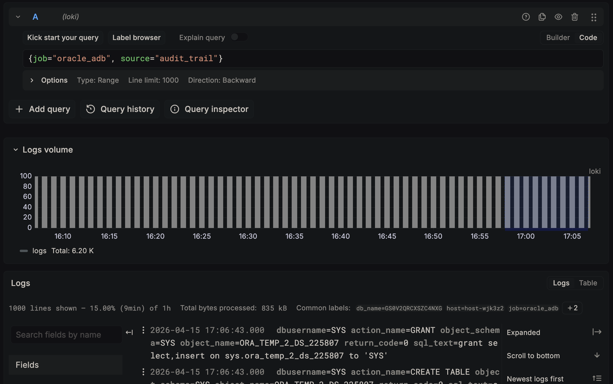
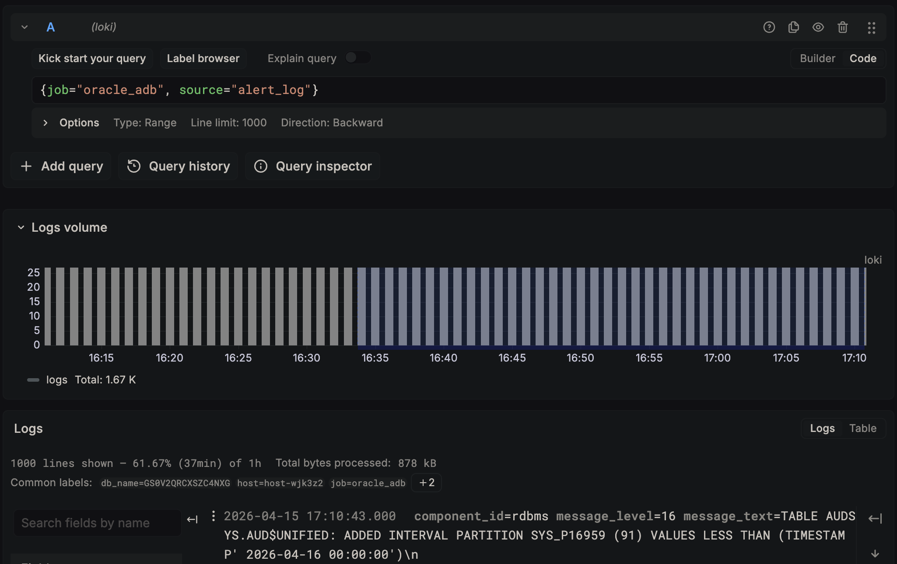

# Lab 3: Configure and Start Continuous Push

## Introduction

In this lab, you will configure the Loki endpoint, perform a test push, verify log entries appear in Grafana, and start the continuous push scheduler job. You will also learn how to backfill historical alert log entries.

*Estimated Lab Time:* 10 minutes

### Objectives

- Configure the Loki endpoint URL
- Test push and verify entries in Grafana Explore
- Start the DBMS_SCHEDULER recurring push job
- Backfill historical alert log entries

### Prerequisites

- Completion of Lab 2
- Grafana accessible via bastion tunnel (port 3000)
- Loki added as a Grafana data source

> **Grafana setup:** If you haven't added Loki as a Grafana data source yet, go to **Connections** → **Data sources** → **Add data source** → select **Loki** → set URL to `http://localhost:3100` → click **Save & test**.

## Task 1: Configure the Loki Endpoint

1. Connect to your ADB-D as **PROMETHEUS_EXPORTER** via SQL Worksheet or SQLcl.

2. Configure the Loki URL:

    ```sql
    
    SET SERVEROUTPUT ON
    EXEC DBMS_LOKI.CONFIGURE('http://<compute_private_ip>:3100');
    
    ```

    > Replace `<compute_private_ip>` with your Loki host's IP. Expected output: `Loki URL configured: http://10.0.0.57:3100`

## Task 2: Test Push

1. Run the test push, which verifies connectivity and pushes a batch from all enabled sources:

    ```sql
    
    SET SERVEROUTPUT ON
    EXEC DBMS_LOKI.TEST_PUSH;
    
    ```

    Expected output:

    ```
    Loki connectivity: 200 ready
    alert_log: pushed 6 entries — Status: 204
    audit_trail: pushed 16 entries — Status: 204
    ```

    > **Note:** If alert_log shows "no new entries," this is normal — alert log entries are infrequent on ADB-D (typically only during nightly partition maintenance). See Task 4 for how to backfill historical entries.

2. Verify in Grafana. Open Grafana → **Explore** → select the **Loki** data source → run:

    ```
    {job="oracle_adb", source="audit_trail"}
    ```

    You should see audit trail entries with usernames, actions, objects, and SQL text.

    

3. Try the alert log query:

    ```
    {job="oracle_adb", source="alert_log"}
    ```

    

## Task 3: Start Continuous Push

1. Start the DBMS_SCHEDULER recurring job (pushes every 60 seconds):

    ```sql
    
    EXEC DBMS_LOKI.START_PUSH(60);
    
    ```

    Expected output:

    ```
    Log push job started — interval: 60s
    Job name: DBMS_LOKI_PUSH_JOB
    ```

2. Verify the job is running:

    ```sql
    
    SELECT job_name, state, last_start_date, next_run_date
    FROM user_scheduler_jobs
    WHERE job_name = 'DBMS_LOKI_PUSH_JOB';
    
    ```

    Expected: `state = SCHEDULED`

3. Wait 2 minutes, then check the watermark progression:

    ```sql
    
    SELECT source_name, push_count, last_pushed, last_error
    FROM loki_push_watermarks;
    
    ```

    You should see `push_count` increasing and `last_error` as NULL.

## Task 4: Backfill Historical Alert Log Entries

The alert log watermark initializes to `SYSTIMESTAMP - 5 MINUTE`, so only new entries are captured by default. On ADB-D, alert log entries are infrequent — to see historical entries for testing, reset the watermark:

1. Reset the alert log watermark to capture the last 7 days:

    ```sql
    
    UPDATE loki_push_watermarks
    SET last_pushed = SYSTIMESTAMP - INTERVAL '7' DAY,
        push_count = 0
    WHERE source_name = 'alert_log';
    COMMIT;
    
    ```

2. Force an immediate push:

    ```sql
    
    SET SERVEROUTPUT ON
    EXEC DBMS_LOKI.PUSH_SOURCE('alert_log');
    
    ```

    You should see entries pushed. The scheduler will continue from the new watermark position.

3. In Grafana, expand the time range to **Last 7 days** and query `{job="oracle_adb", source="alert_log"}` to see the historical entries.

    <!-- Screenshot placeholder: Grafana showing alert log entries spanning multiple days -->

    > **Tip:** Use the same technique for the audit trail, but start with a shorter interval (e.g., 1 hour) to avoid large backfills.

You may now **proceed to the next lab**.

## Acknowledgements

- **Author** - German Viscuso, Product Manager, Oracle Autonomous AI Database
- **Last Updated By/Date** - German Viscuso, April 2026
