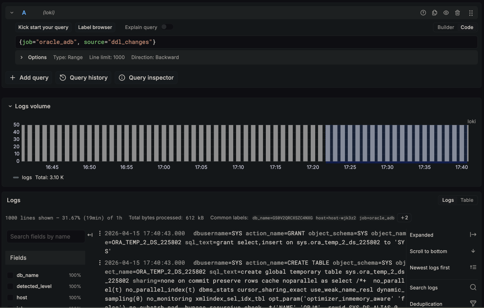
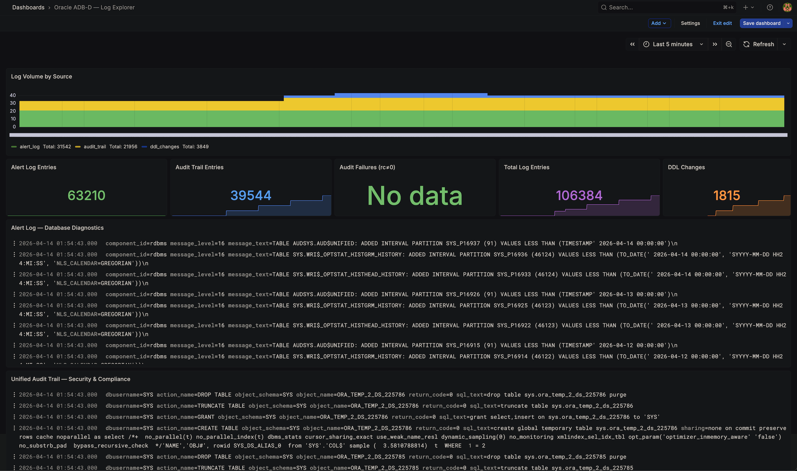

# Lab 5: Add a Custom Log Source (DDL Tracking)

## Introduction

In this lab, you will use the DBMS_LOKI self-service API to register a custom log source that tracks all DDL (schema-modifying) operations. This demonstrates how customers can extend the log pipeline without modifying the package or requesting DBA intervention.

*Estimated Lab Time:* 10 minutes

### Objectives

- Register a custom log source using `ADD_CUSTOM_SOURCE`
- Generate DDL activity to populate the log stream
- Verify DDL entries appear in Grafana
- Explore additional API operations (disable, enable, list, remove)

### Prerequisites

- Completion of Lab 4
- Connected as PROMETHEUS_EXPORTER in SQL Worksheet or SQLcl

## Task 1: Register the DDL Changes Source

1. Connect as **PROMETHEUS_EXPORTER** in SQL Worksheet or SQLcl.

2. Register the custom source:

    ```sql
    
    BEGIN
        DBMS_LOKI.ADD_CUSTOM_SOURCE(
            p_source_name   => 'ddl_changes',
            p_source_sql    => q'[SELECT event_timestamp AS log_ts,
                                         dbusername, action_name,
                                         object_schema, object_name, sql_text
                                  FROM admin.v_audit_trail
                                  WHERE action_name IN (
                                      'CREATE TABLE','ALTER TABLE','DROP TABLE',
                                      'CREATE INDEX','DROP INDEX',
                                      'CREATE VIEW','DROP VIEW',
                                      'CREATE PROCEDURE','DROP PROCEDURE',
                                      'CREATE PACKAGE','DROP PACKAGE',
                                      'GRANT','REVOKE')
                                  AND event_timestamp > :watermark
                                  ORDER BY event_timestamp ASC
                                  FETCH FIRST 50 ROWS ONLY]',
            p_stream_labels => 'source:ddl_changes',
            p_timestamp_col => 'log_ts',
            p_message_cols  => 'dbusername,action_name,object_schema,object_name,sql_text'
        );
    END;
    /
    
    ```

    Expected output: `Custom source "ddl_changes" registered.`

    > **Note:** The source SQL must include a `:watermark` bind variable. The engine binds this to the last pushed timestamp for incremental delivery. Without it, the registration will fail with `ORA-20121`.

## Task 2: Verify the Registration

1. List all registered sources:

    ```sql
    
    SELECT source_name, is_enabled, is_builtin
    FROM TABLE(DBMS_LOKI.LIST_SOURCES);
    
    ```

    Expected output:

    | SOURCE_NAME | IS_ENABLED | IS_BUILTIN |
    |---|---|---|
    | alert_log | 1 | 1 |
    | audit_trail | 1 | 1 |
    | ddl_changes | 1 | 0 |

    The custom source shows `is_builtin = 0` — it can be removed (unlike built-in sources which can only be disabled).

## Task 3: Generate DDL Activity

1. Run some DDL operations to generate test entries:

    ```sql
    
    CREATE TABLE test_ddl_tracking (id NUMBER, name VARCHAR2(100));
    ALTER TABLE test_ddl_tracking ADD (created_at TIMESTAMP DEFAULT SYSTIMESTAMP);
    CREATE INDEX idx_test_ddl ON test_ddl_tracking(name);
    DROP INDEX idx_test_ddl;
    DROP TABLE test_ddl_tracking PURGE;
    
    ```

## Task 4: Push and Verify

1. Push the DDL changes source immediately (don't wait for the scheduler):

    ```sql
    
    SET SERVEROUTPUT ON
    EXEC DBMS_LOKI.PUSH_SOURCE('ddl_changes');
    
    ```

    > **Note:** The unified audit trail has a write-behind flush delay (15–30 seconds). If the first push shows "no new entries," wait 30 seconds and try again.

2. Verify in Grafana. Go to **Explore** → Loki → query:

    ```
    {job="oracle_adb", source="ddl_changes"}
    ```

    You should see the CREATE TABLE, ALTER TABLE, CREATE INDEX, DROP INDEX, and DROP TABLE entries.

    

## Task 5: Explore API Operations (Optional)

1. **Disable** a source (it will stop being pushed during scheduler cycles):

    ```sql
    
    EXEC DBMS_LOKI.DISABLE_SOURCE('ddl_changes');
    
    ```

2. **Re-enable** it:

    ```sql
    
    EXEC DBMS_LOKI.ENABLE_SOURCE('ddl_changes');
    
    ```

3. Try to **remove** a built-in source (this should fail):

    ```sql
    
    EXEC DBMS_LOKI.REMOVE_CUSTOM_SOURCE('alert_log');
    
    ```

    Expected error: `ORA-20131: Cannot remove built-in source. Use DISABLE_SOURCE instead.`

4. **Remove** the custom source (you can re-add it later):

    ```sql
    
    EXEC DBMS_LOKI.REMOVE_CUSTOM_SOURCE('ddl_changes');
    
    ```

    > **Note:** Removing a source also deletes its watermark (via `ON DELETE CASCADE`). If you re-add it, the watermark re-initializes to `SYSTIMESTAMP - 5 MINUTE`.

5. Re-add it for the next lab:

    ```sql
    
    BEGIN
        DBMS_LOKI.ADD_CUSTOM_SOURCE(
            p_source_name   => 'ddl_changes',
            p_source_sql    => q'[SELECT event_timestamp AS log_ts,
                                         dbusername, action_name,
                                         object_schema, object_name, sql_text
                                  FROM admin.v_audit_trail
                                  WHERE action_name IN (
                                      'CREATE TABLE','ALTER TABLE','DROP TABLE',
                                      'CREATE INDEX','DROP INDEX',
                                      'CREATE VIEW','DROP VIEW',
                                      'GRANT','REVOKE')
                                  AND event_timestamp > :watermark
                                  ORDER BY event_timestamp ASC
                                  FETCH FIRST 50 ROWS ONLY]',
            p_stream_labels => 'source:ddl_changes',
            p_timestamp_col => 'log_ts',
            p_message_cols  => 'dbusername,action_name,object_schema,object_name,sql_text'
        );
    END;
    /
    
    ```

## Task 6: Update the Dashboard with the DDL Changes Panel

Now that you have a third log source streaming, update your Grafana dashboard to include a dedicated DDL Changes panel and KPI card.

1. Copy the new dashboard JSON code:

    ```json
    {
    "annotations": {
        "list": [
        {
            "builtIn": 1,
            "datasource": {
            "type": "grafana",
            "uid": "-- Grafana --"
            },
            "enable": true,
            "hide": true,
            "iconColor": "rgba(0, 211, 255, 1)",
            "name": "Annotations & Alerts",
            "type": "dashboard"
        }
        ]
    },
    "editable": true,
    "fiscalYearStartMonth": 0,
    "graphTooltip": 1,
    "links": [],
    "panels": [
        {
        "datasource": {
            "type": "prometheus",
            "uid": "<your_prometheus_datasource_uid>"
        },
        "fieldConfig": {
            "defaults": {
            "color": {
                "fixedColor": "text",
                "mode": "fixed"
            },
            "mappings": [],
            "thresholds": {
                "mode": "absolute",
                "steps": [
                {
                    "color": "text",
                    "value": null
                }
                ]
            }
            },
            "overrides": []
        },
        "gridPos": {
            "h": 3,
            "w": 24,
            "x": 0,
            "y": 0
        },
        "id": 20,
        "options": {
            "colorMode": "none",
            "graphMode": "none",
            "justifyMode": "auto",
            "orientation": "horizontal",
            "reduceOptions": {
            "calcs": [
                "lastNotNull"
            ],
            "fields": "",
            "values": false
            },
            "showPercentChange": false,
            "textMode": "name",
            "wideLayout": true
        },
        "targets": [
            {
            "datasource": {
                "type": "prometheus",
                "uid": "<your_datasource_uid>"
            },
            "expr": "oracledb_info",
            "legendFormat": "Database: {{db_name}}    |    Host: {{server_host}}    |    Service: {{service_name}}",
            "refId": "A"
            }
        ],
        "title": "",
        "transparent": true,
        "type": "stat"
        },
        {
        "datasource": {
            "type": "loki",
            "uid": "<your_loki_datasource_uid>"
        },
        "fieldConfig": {
            "defaults": {
            "color": {
                "mode": "palette-classic"
            },
            "custom": {
                "axisBorderShow": false,
                "axisCenteredZero": false,
                "axisLabel": "",
                "fillOpacity": 40,
                "lineWidth": 1,
                "scaleDistribution": {
                "type": "linear"
                },
                "stacking": {
                "group": "A",
                "mode": "normal"
                }
            }
            },
            "overrides": [
            {
                "matcher": {
                "id": "byName",
                "options": "{source=\"alert_log\"}"
                },
                "properties": [
                {
                    "id": "color",
                    "value": {
                    "fixedColor": "#F2495C",
                    "mode": "fixed"
                    }
                }
                ]
            },
            {
                "matcher": {
                "id": "byName",
                "options": "{source=\"audit_trail\"}"
                },
                "properties": [
                {
                    "id": "color",
                    "value": {
                    "fixedColor": "#5794F2",
                    "mode": "fixed"
                    }
                }
                ]
            }
            ]
        },
        "gridPos": {
            "h": 6,
            "w": 24,
            "x": 0,
            "y": 3
        },
        "id": 1,
        "options": {
            "barRadius": 0,
            "barWidth": 0.9,
            "fullHighlight": false,
            "groupWidth": 0.7,
            "legend": {
            "calcs": [
                "sum"
            ],
            "displayMode": "list",
            "placement": "bottom"
            },
            "orientation": "auto",
            "showValue": "never",
            "stacking": "normal",
            "tooltip": {
            "mode": "multi",
            "sort": "desc"
            },
            "xTickLabelRotation": 0
        },
        "targets": [
            {
            "datasource": {
                "type": "loki",
                "uid": "<your_loki_datasource_uid>"
            },
            "expr": "sum by (source) (count_over_time({job=\"oracle_adb\"} [1m]))",
            "legendFormat": "{{source}}",
            "refId": "A"
            }
        ],
        "title": "Log Volume by Source",
        "type": "barchart"
        },
        {
        "datasource": {
            "type": "loki",
            "uid": "<your_loki_datasource_uid>"
        },
        "fieldConfig": {
            "defaults": {
            "color": {
                "mode": "thresholds"
            },
            "mappings": [],
            "thresholds": {
                "mode": "absolute",
                "steps": [
                {
                    "color": "green",
                    "value": null
                }
                ]
            }
            },
            "overrides": []
        },
        "gridPos": {
            "h": 4,
            "w": 5,
            "x": 0,
            "y": 9
        },
        "id": 10,
        "options": {
            "colorMode": "value",
            "graphMode": "area",
            "justifyMode": "auto",
            "orientation": "auto",
            "reduceOptions": {
            "calcs": [
                "sum"
            ],
            "fields": "",
            "values": false
            },
            "textMode": "auto"
        },
        "targets": [
            {
            "datasource": {
                "type": "loki",
                "uid": "<your_loki_datasource_uid>"
            },
            "expr": "sum(count_over_time({job=\"oracle_adb\", source=\"alert_log\"} [$__range]))",
            "refId": "A"
            }
        ],
        "title": "Alert Log Entries",
        "type": "stat"
        },
        {
        "datasource": {
            "type": "loki",
            "uid": "<your_loki_datasource_uid>"
        },
        "fieldConfig": {
            "defaults": {
            "color": {
                "mode": "thresholds"
            },
            "mappings": [],
            "thresholds": {
                "mode": "absolute",
                "steps": [
                {
                    "color": "blue",
                    "value": null
                }
                ]
            }
            },
            "overrides": []
        },
        "gridPos": {
            "h": 4,
            "w": 5,
            "x": 5,
            "y": 9
        },
        "id": 11,
        "options": {
            "colorMode": "value",
            "graphMode": "area",
            "justifyMode": "auto",
            "orientation": "auto",
            "reduceOptions": {
            "calcs": [
                "sum"
            ],
            "fields": "",
            "values": false
            },
            "textMode": "auto"
        },
        "targets": [
            {
            "datasource": {
                "type": "loki",
                "uid": "<your_loki_datasource_uid>"
            },
            "expr": "sum(count_over_time({job=\"oracle_adb\", source=\"audit_trail\"} [$__range]))",
            "refId": "A"
            }
        ],
        "title": "Audit Trail Entries",
        "type": "stat"
        },
        {
        "datasource": {
            "type": "loki",
            "uid": "<your_loki_datasource_uid>"
        },
        "fieldConfig": {
            "defaults": {
            "color": {
                "mode": "thresholds"
            },
            "mappings": [],
            "thresholds": {
                "mode": "absolute",
                "steps": [
                {
                    "color": "green",
                    "value": null
                },
                {
                    "color": "yellow",
                    "value": 10
                },
                {
                    "color": "red",
                    "value": 50
                }
                ]
            }
            },
            "overrides": []
        },
        "gridPos": {
            "h": 4,
            "w": 5,
            "x": 10,
            "y": 9
        },
        "id": 12,
        "options": {
            "colorMode": "value",
            "graphMode": "none",
            "justifyMode": "auto",
            "orientation": "auto",
            "reduceOptions": {
            "calcs": [
                "sum"
            ],
            "fields": "",
            "values": false
            },
            "textMode": "auto"
        },
        "targets": [
            {
            "datasource": {
                "type": "loki",
                "uid": "<your_loki_datasource_uid>"
            },
            "expr": "sum(count_over_time({job=\"oracle_adb\", source=\"audit_trail\"} |= \"rc=\" != \"rc=0\" [$__range]))",
            "refId": "A"
            }
        ],
        "title": "Audit Failures (rc\u22600)",
        "type": "stat"
        },
        {
        "datasource": {
            "type": "loki",
            "uid": "<your_loki_datasource_uid>"
        },
        "fieldConfig": {
            "defaults": {
            "color": {
                "mode": "thresholds"
            },
            "mappings": [],
            "thresholds": {
                "mode": "absolute",
                "steps": [
                {
                    "color": "purple",
                    "value": null
                }
                ]
            }
            },
            "overrides": []
        },
        "gridPos": {
            "h": 4,
            "w": 5,
            "x": 15,
            "y": 9
        },
        "id": 13,
        "options": {
            "colorMode": "value",
            "graphMode": "area",
            "justifyMode": "auto",
            "orientation": "auto",
            "reduceOptions": {
            "calcs": [
                "sum"
            ],
            "fields": "",
            "values": false
            },
            "textMode": "auto"
        },
        "targets": [
            {
            "datasource": {
                "type": "loki",
                "uid": "<your_loki_datasource_uid>"
            },
            "expr": "sum(count_over_time({job=\"oracle_adb\"} [$__range]))",
            "refId": "A"
            }
        ],
        "title": "Total Log Entries",
        "type": "stat"
        },
        {
        "datasource": {
            "type": "loki",
            "uid": "<your_loki_datasource_uid>"
        },
        "gridPos": {
            "h": 10,
            "w": 24,
            "x": 0,
            "y": 13
        },
        "id": 2,
        "options": {
            "dedupStrategy": "none",
            "enableLogDetails": true,
            "prettifyLogMessage": false,
            "showCommonLabels": true,
            "showLabels": false,
            "showTime": true,
            "sortOrder": "Descending",
            "wrapLogMessage": true
        },
        "targets": [
            {
            "datasource": {
                "type": "loki",
                "uid": "<your_loki_datasource_uid>"
            },
            "expr": "{job=\"oracle_adb\", source=\"alert_log\"}",
            "refId": "A"
            }
        ],
        "title": "Alert Log \u2014 Database Diagnostics",
        "type": "logs"
        },
        {
        "datasource": {
            "type": "loki",
            "uid": "<your_loki_datasource_uid>"
        },
        "gridPos": {
            "h": 10,
            "w": 24,
            "x": 0,
            "y": 23
        },
        "id": 3,
        "options": {
            "dedupStrategy": "none",
            "enableLogDetails": true,
            "prettifyLogMessage": false,
            "showCommonLabels": true,
            "showLabels": false,
            "showTime": true,
            "sortOrder": "Descending",
            "wrapLogMessage": true
        },
        "targets": [
            {
            "datasource": {
                "type": "loki",
                "uid": "<your_loki_datasource_uid>"
            },
            "expr": "{job=\"oracle_adb\", source=\"audit_trail\"}",
            "refId": "A"
            }
        ],
        "title": "Unified Audit Trail \u2014 Security & Compliance",
        "type": "logs"
        },
        {
        "datasource": {
            "type": "loki",
            "uid": "<your_loki_datasource_uid>"
        },
        "fieldConfig": {
            "defaults": {
            "color": {
                "mode": "palette-classic"
            },
            "custom": {
                "axisBorderShow": false,
                "fillOpacity": 60,
                "lineWidth": 1,
                "stacking": {
                "group": "A",
                "mode": "normal"
                }
            }
            },
            "overrides": []
        },
        "gridPos": {
            "h": 8,
            "w": 12,
            "x": 0,
            "y": 43
        },
        "id": 4,
        "options": {
            "barRadius": 0,
            "barWidth": 0.9,
            "fullHighlight": false,
            "groupWidth": 0.7,
            "legend": {
            "calcs": [
                "sum"
            ],
            "displayMode": "list",
            "placement": "bottom"
            },
            "orientation": "auto",
            "showValue": "never",
            "stacking": "normal",
            "tooltip": {
            "mode": "multi",
            "sort": "desc"
            }
        },
        "targets": [
            {
            "datasource": {
                "type": "loki",
                "uid": "<your_loki_datasource_uid>"
            },
            "expr": "sum by (action) (count_over_time({job=\"oracle_adb\", source=\"audit_trail\"} | pattern `<_> action=<action> <_>` [5m]))",
            "legendFormat": "{{action}}",
            "refId": "A"
            }
        ],
        "title": "Audit Actions Over Time",
        "type": "barchart"
        },
        {
        "datasource": {
            "type": "loki",
            "uid": "<your_loki_datasource_uid>"
        },
        "fieldConfig": {
            "defaults": {
            "color": {
                "mode": "palette-classic"
            },
            "custom": {
                "axisBorderShow": false,
                "fillOpacity": 60,
                "lineWidth": 1,
                "stacking": {
                "group": "A",
                "mode": "normal"
                }
            }
            },
            "overrides": []
        },
        "gridPos": {
            "h": 8,
            "w": 12,
            "x": 12,
            "y": 43
        },
        "id": 5,
        "options": {
            "barRadius": 0,
            "barWidth": 0.9,
            "fullHighlight": false,
            "groupWidth": 0.7,
            "legend": {
            "calcs": [
                "sum"
            ],
            "displayMode": "list",
            "placement": "bottom"
            },
            "orientation": "auto",
            "showValue": "never",
            "stacking": "normal",
            "tooltip": {
            "mode": "multi",
            "sort": "desc"
            }
        },
        "targets": [
            {
            "datasource": {
                "type": "loki",
                "uid": "<your_loki_datasource_uid>"
            },
            "expr": "sum by (user) (count_over_time({job=\"oracle_adb\", source=\"audit_trail\"} | pattern `<_> user=<user> <_>` [5m]))",
            "legendFormat": "{{user}}",
            "refId": "A"
            }
        ],
        "title": "Audit Activity by User",
        "type": "barchart"
        },
        {
        "datasource": {
            "type": "loki",
            "uid": "<your_loki_datasource_uid>"
        },
        "gridPos": {
            "h": 10,
            "w": 24,
            "x": 0,
            "y": 33
        },
        "id": 6,
        "options": {
            "dedupStrategy": "none",
            "enableLogDetails": true,
            "prettifyLogMessage": false,
            "showCommonLabels": true,
            "showLabels": false,
            "showTime": true,
            "sortOrder": "Descending",
            "wrapLogMessage": true
        },
        "targets": [
            {
            "datasource": {
                "type": "loki",
                "uid": "<your_loki_datasource_uid>"
            },
            "expr": "{job=\"oracle_adb\", source=\"ddl_changes\"}",
            "refId": "A"
            }
        ],
        "title": "DDL Changes \u2014 Schema Change Tracking",
        "type": "logs"
        },
        {
        "datasource": {
            "type": "loki",
            "uid": "<your_loki_datasource_uid>"
        },
        "fieldConfig": {
            "defaults": {
            "color": {
                "mode": "thresholds"
            },
            "mappings": [],
            "thresholds": {
                "mode": "absolute",
                "steps": [
                {
                    "color": "orange",
                    "value": null
                }
                ]
            }
            },
            "overrides": []
        },
        "gridPos": {
            "h": 4,
            "w": 4,
            "x": 20,
            "y": 9
        },
        "id": 14,
        "options": {
            "colorMode": "value",
            "graphMode": "area",
            "justifyMode": "auto",
            "orientation": "auto",
            "reduceOptions": {
            "calcs": [
                "sum"
            ],
            "fields": "",
            "values": false
            },
            "textMode": "auto"
        },
        "targets": [
            {
            "datasource": {
                "type": "loki",
                "uid": "<your_loki_datasource_uid>"
            },
            "expr": "sum(count_over_time({job=\"oracle_adb\", source=\"ddl_changes\"} [$__range]))",
            "refId": "A"
            }
        ],
        "title": "DDL Changes",
        "type": "stat"
        }
    ],
    "schemaVersion": 42,
    "tags": [
        "oracle",
        "adb-d",
        "loki",
        "logs"
    ],
    "templating": {
        "list": []
    },
    "time": {
        "from": "now-1h",
        "to": "now"
    },
    "timepicker": {},
    "timezone": "browser",
    "title": "Oracle ADB-D \u2014 Log Explorer",
    "uid": "oracle-adb-logs",
    "version": 1
    }
    ```

    > **Note:** This is an updated version of the dashboard you imported in [Lab 4: Import the Log Explorer Dashboard](../import-dashboard/import-dashboard.md). It adds a **DDL Changes — Schema Change Tracking** log viewer panel and a **DDL Changes** KPI stat card (orange) to the existing layout.

2. Replace the data source UIDs in the JSON just as you did in Lab 4, Task 2:

    - Replace all occurrences of `<your_loki_datasource_uid>` with your Loki data source UID
    - Replace `<your_prometheus_datasource_uid>` with your Prometheus data source UID (or remove the header panel if not applicable)

3. Import the updated dashboard following the same steps from [Lab 4, Task 3](../import-dashboard/import-dashboard.md):

    - Navigate to **Dashboards** → **New** → **Import**
    - Paste the JSON code
    - If prompted about a duplicate UID, select **Overwrite** to replace the existing dashboard

4. Verify the new panels are visible:

    - The **DDL Changes** KPI card (orange) should appear in the stats row alongside Alert Log Entries, Audit Trail Entries, Audit Failures, and Total Log Entries
    - The **DDL Changes — Schema Change Tracking** log viewer panel should appear between the Audit Trail panel and the analytics charts
    - Both panels should show the DDL activity you generated in Task 3

    

You may now **proceed to the next and final lab**.

## Acknowledgements

- **Author** - German Viscuso, Product Manager, Oracle Autonomous AI Database
- **Last Updated By/Date** - German Viscuso, April 2026
