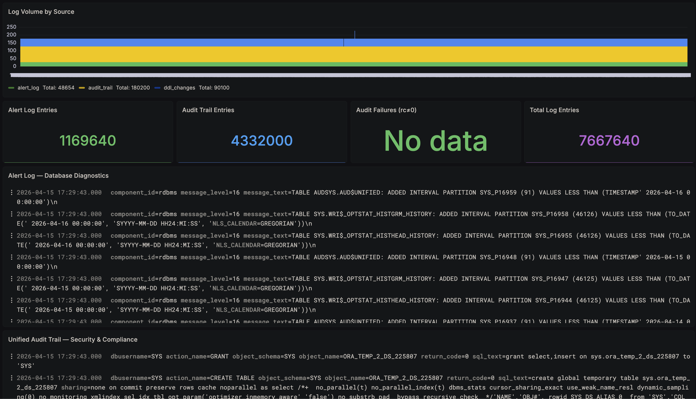

# Lab 4: Import the Log Explorer Dashboard

## Introduction

In this lab, you will import a pre-built Grafana dashboard that provides a comprehensive Log Explorer for your ADB-D instance. The dashboard includes log volume charts, KPI cards, log stream viewers, and audit analytics panels.

*Estimated Lab Time:* 10 minutes

### Objectives

- Note your Loki data source UID
- Import the Log Explorer dashboard JSON
- Explore all dashboard panels

### Prerequisites

- Completion of Lab 3
- Grafana accessible via bastion tunnel
- Loki added as a data source with log entries flowing

## Task 1: Note Your Data Source UIDs

1. In Grafana, navigate to **Connections** → **Data sources** → click your **Loki** data source.

2. Note the UID from the URL. For example: `http://localhost:3000/connections/datasources/edit/dfj0375t0f2tca` → the UID is `dfj0375t0f2tca`.

3. If you also have **Prometheus** configured (from the companion workshop), note its UID as well — the dashboard includes an optional database identity header panel that uses a Prometheus metric.

## Task 2: Prepare the Dashboard JSON

1. Copy the dashboard JSON below:

    ```json
    {
    "annotations": {
        "list": [
        {
            "builtIn": 1,
            "datasource": { "type": "grafana", "uid": "-- Grafana --" },
            "enable": true,
            "hide": true,
            "iconColor": "rgba(0, 211, 255, 1)",
            "name": "Annotations & Alerts",
            "type": "dashboard"
        }
        ]
    },
    "editable": true,
    "fiscalYearStartMonth": 0,
    "graphTooltip": 1,
    "links": [],
    "panels": [
        {
        "datasource": { "type": "prometheus", "uid": "<your_prometheus_datasource_uid>" },
        "fieldConfig": {
            "defaults": {
            "color": { "fixedColor": "text", "mode": "fixed" },
            "mappings": [],
            "thresholds": { "mode": "absolute", "steps": [{ "color": "text", "value": null }] }
            },
            "overrides": []
        },
        "gridPos": { "h": 3, "w": 24, "x": 0, "y": 0 },
        "id": 20,
        "options": {
            "colorMode": "none",
            "graphMode": "none",
            "justifyMode": "auto",
            "orientation": "horizontal",
            "reduceOptions": { "calcs": ["lastNotNull"], "fields": "", "values": false },
            "showPercentChange": false,
            "textMode": "name",
            "wideLayout": true
        },
        "targets": [
            {
            "datasource": { "type": "prometheus", "uid": "<your_datasource_uid>" },
            "expr": "oracledb_info",
            "legendFormat": "Database: {{db_name}}    |    Host: {{server_host}}    |    Service: {{service_name}}",
            "refId": "A"
            }
        ],
        "title": "",
        "transparent": true,
        "type": "stat"
        },
        {
        "datasource": { "type": "loki", "uid": "<your_loki_datasource_uid>" },
        "fieldConfig": {
            "defaults": {
            "color": { "mode": "palette-classic" },
            "custom": {
                "axisBorderShow": false,
                "axisCenteredZero": false,
                "axisLabel": "",
                "fillOpacity": 40,
                "lineWidth": 1,
                "scaleDistribution": { "type": "linear" },
                "stacking": { "group": "A", "mode": "normal" }
            }
            },
            "overrides": [
            {
                "matcher": { "id": "byName", "options": "{source=\"alert_log\"}" },
                "properties": [{ "id": "color", "value": { "fixedColor": "#F2495C", "mode": "fixed" } }]
            },
            {
                "matcher": { "id": "byName", "options": "{source=\"audit_trail\"}" },
                "properties": [{ "id": "color", "value": { "fixedColor": "#5794F2", "mode": "fixed" } }]
            }
            ]
        },
        "gridPos": { "h": 6, "w": 24, "x": 0, "y": 3 },
        "id": 1,
        "options": {
            "barRadius": 0,
            "barWidth": 0.9,
            "fullHighlight": false,
            "groupWidth": 0.7,
            "legend": { "calcs": ["sum"], "displayMode": "list", "placement": "bottom" },
            "orientation": "auto",
            "showValue": "never",
            "stacking": "normal",
            "tooltip": { "mode": "multi", "sort": "desc" },
            "xTickLabelRotation": 0
        },
        "targets": [
            {
            "datasource": { "type": "loki", "uid": "<your_loki_datasource_uid>" },
            "expr": "sum by (source) (count_over_time({job=\"oracle_adb\"} [1m]))",
            "legendFormat": "{{source}}",
            "refId": "A"
            }
        ],
        "title": "Log Volume by Source",
        "type": "barchart"
        },
        {
        "datasource": { "type": "loki", "uid": "<your_loki_datasource_uid>" },
        "fieldConfig": {
            "defaults": {
            "color": { "mode": "thresholds" },
            "mappings": [],
            "thresholds": { "mode": "absolute", "steps": [{ "color": "green", "value": null }] }
            },
            "overrides": []
        },
        "gridPos": { "h": 4, "w": 6, "x": 0, "y": 9 },
        "id": 10,
        "options": {
            "colorMode": "value",
            "graphMode": "area",
            "justifyMode": "auto",
            "orientation": "auto",
            "reduceOptions": { "calcs": ["sum"], "fields": "", "values": false },
            "textMode": "auto"
        },
        "targets": [
            {
            "datasource": { "type": "loki", "uid": "<your_loki_datasource_uid>" },
            "expr": "sum(count_over_time({job=\"oracle_adb\", source=\"alert_log\"} [$__range]))",
            "refId": "A"
            }
        ],
        "title": "Alert Log Entries",
        "type": "stat"
        },
        {
        "datasource": { "type": "loki", "uid": "<your_loki_datasource_uid>" },
        "fieldConfig": {
            "defaults": {
            "color": { "mode": "thresholds" },
            "mappings": [],
            "thresholds": { "mode": "absolute", "steps": [{ "color": "blue", "value": null }] }
            },
            "overrides": []
        },
        "gridPos": { "h": 4, "w": 6, "x": 6, "y": 9 },
        "id": 11,
        "options": {
            "colorMode": "value",
            "graphMode": "area",
            "justifyMode": "auto",
            "orientation": "auto",
            "reduceOptions": { "calcs": ["sum"], "fields": "", "values": false },
            "textMode": "auto"
        },
        "targets": [
            {
            "datasource": { "type": "loki", "uid": "<your_loki_datasource_uid>" },
            "expr": "sum(count_over_time({job=\"oracle_adb\", source=\"audit_trail\"} [$__range]))",
            "refId": "A"
            }
        ],
        "title": "Audit Trail Entries",
        "type": "stat"
        },
        {
        "datasource": { "type": "loki", "uid": "<your_loki_datasource_uid>" },
        "fieldConfig": {
            "defaults": {
            "color": { "mode": "thresholds" },
            "mappings": [],
            "thresholds": { "mode": "absolute", "steps": [
                { "color": "green", "value": null },
                { "color": "yellow", "value": 10 },
                { "color": "red", "value": 50 }
            ]}
            },
            "overrides": []
        },
        "gridPos": { "h": 4, "w": 6, "x": 12, "y": 9 },
        "id": 12,
        "options": {
            "colorMode": "value",
            "graphMode": "none",
            "justifyMode": "auto",
            "orientation": "auto",
            "reduceOptions": { "calcs": ["sum"], "fields": "", "values": false },
            "textMode": "auto"
        },
        "targets": [
            {
            "datasource": { "type": "loki", "uid": "<your_loki_datasource_uid>" },
            "expr": "sum(count_over_time({job=\"oracle_adb\", source=\"audit_trail\"} |= \"rc=\" != \"rc=0\" [$__range]))",
            "refId": "A"
            }
        ],
        "title": "Audit Failures (rc≠0)",
        "type": "stat"
        },
        {
        "datasource": { "type": "loki", "uid": "<your_loki_datasource_uid>" },
        "fieldConfig": {
            "defaults": {
            "color": { "mode": "thresholds" },
            "mappings": [],
            "thresholds": { "mode": "absolute", "steps": [{ "color": "purple", "value": null }] }
            },
            "overrides": []
        },
        "gridPos": { "h": 4, "w": 6, "x": 18, "y": 9 },
        "id": 13,
        "options": {
            "colorMode": "value",
            "graphMode": "area",
            "justifyMode": "auto",
            "orientation": "auto",
            "reduceOptions": { "calcs": ["sum"], "fields": "", "values": false },
            "textMode": "auto"
        },
        "targets": [
            {
            "datasource": { "type": "loki", "uid": "<your_loki_datasource_uid>" },
            "expr": "sum(count_over_time({job=\"oracle_adb\"} [$__range]))",
            "refId": "A"
            }
        ],
        "title": "Total Log Entries",
        "type": "stat"
        },
        {
        "datasource": { "type": "loki", "uid": "<your_loki_datasource_uid>" },
        "gridPos": { "h": 10, "w": 24, "x": 0, "y": 13 },
        "id": 2,
        "options": {
            "dedupStrategy": "none",
            "enableLogDetails": true,
            "prettifyLogMessage": false,
            "showCommonLabels": true,
            "showLabels": false,
            "showTime": true,
            "sortOrder": "Descending",
            "wrapLogMessage": true
        },
        "targets": [
            {
            "datasource": { "type": "loki", "uid": "<your_loki_datasource_uid>" },
            "expr": "{job=\"oracle_adb\", source=\"alert_log\"}",
            "refId": "A"
            }
        ],
        "title": "Alert Log — Database Diagnostics",
        "type": "logs"
        },
        {
        "datasource": { "type": "loki", "uid": "<your_loki_datasource_uid>" },
        "gridPos": { "h": 10, "w": 24, "x": 0, "y": 23 },
        "id": 3,
        "options": {
            "dedupStrategy": "none",
            "enableLogDetails": true,
            "prettifyLogMessage": false,
            "showCommonLabels": true,
            "showLabels": false,
            "showTime": true,
            "sortOrder": "Descending",
            "wrapLogMessage": true
        },
        "targets": [
            {
            "datasource": { "type": "loki", "uid": "<your_loki_datasource_uid>" },
            "expr": "{job=\"oracle_adb\", source=\"audit_trail\"}",
            "refId": "A"
            }
        ],
        "title": "Unified Audit Trail — Security & Compliance",
        "type": "logs"
        },
        {
        "datasource": { "type": "loki", "uid": "<your_loki_datasource_uid>" },
        "fieldConfig": {
            "defaults": {
            "color": { "mode": "palette-classic" },
            "custom": {
                "axisBorderShow": false,
                "fillOpacity": 60,
                "lineWidth": 1,
                "stacking": { "group": "A", "mode": "normal" }
            }
            },
            "overrides": []
        },
        "gridPos": { "h": 8, "w": 12, "x": 0, "y": 33 },
        "id": 4,
        "options": {
            "barRadius": 0,
            "barWidth": 0.9,
            "fullHighlight": false,
            "groupWidth": 0.7,
            "legend": { "calcs": ["sum"], "displayMode": "list", "placement": "bottom" },
            "orientation": "auto",
            "showValue": "never",
            "stacking": "normal",
            "tooltip": { "mode": "multi", "sort": "desc" }
        },
        "targets": [
            {
            "datasource": { "type": "loki", "uid": "<your_loki_datasource_uid>" },
            "expr": "sum by (action) (count_over_time({job=\"oracle_adb\", source=\"audit_trail\"} | pattern `<_> action=<action> <_>` [5m]))",
            "legendFormat": "{{action}}",
            "refId": "A"
            }
        ],
        "title": "Audit Actions Over Time",
        "type": "barchart"
        },
        {
        "datasource": { "type": "loki", "uid": "<your_loki_datasource_uid>" },
        "fieldConfig": {
            "defaults": {
            "color": { "mode": "palette-classic" },
            "custom": {
                "axisBorderShow": false,
                "fillOpacity": 60,
                "lineWidth": 1,
                "stacking": { "group": "A", "mode": "normal" }
            }
            },
            "overrides": []
        },
        "gridPos": { "h": 8, "w": 12, "x": 12, "y": 33 },
        "id": 5,
        "options": {
            "barRadius": 0,
            "barWidth": 0.9,
            "fullHighlight": false,
            "groupWidth": 0.7,
            "legend": { "calcs": ["sum"], "displayMode": "list", "placement": "bottom" },
            "orientation": "auto",
            "showValue": "never",
            "stacking": "normal",
            "tooltip": { "mode": "multi", "sort": "desc" }
        },
        "targets": [
            {
            "datasource": { "type": "loki", "uid": "<your_loki_datasource_uid>" },
            "expr": "sum by (user) (count_over_time({job=\"oracle_adb\", source=\"audit_trail\"} | pattern `<_> user=<user> <_>` [5m]))",
            "legendFormat": "{{user}}",
            "refId": "A"
            }
        ],
        "title": "Audit Activity by User",
        "type": "barchart"
        }
    ],
    "schemaVersion": 42,
    "tags": ["oracle", "adb-d", "loki", "logs"],
    "templating": { "list": [] },
    "time": { "from": "now-1h", "to": "now" },
    "timepicker": {},
    "timezone": "browser",
    "title": "Oracle ADB-D — Log Explorer",
    "uid": "oracle-adb-logs",
    "version": 1
    }
    ```

2. Replace all placeholder UIDs in the JSON:

    - Replace all occurrences of `<your_loki_datasource_uid>` with your Loki data source UID
    - Replace `<your_prometheus_datasource_uid>` and `<your_datasource_uid>` with your Prometheus data source UID

    > **No Prometheus?** If you don't have the companion Prometheus setup, simply delete the first panel (the database identity header — panel id 20) from the JSON before importing.

## Task 3: Import the Dashboard

1. In Grafana, navigate to **Dashboards** → **New** → **Import** and click on **Import dashboard**.

    

2. Paste the JSON code in the **Import via dashboard JSON model** window.

3. Click the **Load** button below the import window.

    

## Task 4: Explore the Dashboard

The dashboard has 12 panels organized in 6 rows:

1. **Database Identity** (optional) — shows DB name, host, and service name using the Prometheus `oracledb_info` metric

2. **Log Volume by Source** — stacked bar chart showing log entry volume over time, colored by source: alert_log (green), audit_trail (yellow)

3. **KPI Cards row:**
    - **Alert Log Entries** — total in selected time range
    - **Audit Trail Entries** — total in selected time range
    - **Audit Failures (rc≠0)** — failed operations count (color-coded: green < 10, yellow < 50, red ≥ 50)
    - **Total Log Entries** — combined total
    - **DDL Changes** — schema change count (visible after Lab 5)

4. **Alert Log — Database Diagnostics** — full log viewer with timestamps, log detail expansion, and text search

5. **Unified Audit Trail — Security & Compliance** — full log viewer for audit entries

6. **Analytics row:**
    - **Audit Actions Over Time** — stacked bar chart breaking down by action type (CREATE TABLE, DROP, GRANT, etc.)
    - **Audit Activity by User** — stacked bar chart showing which users are generating audit events



Try these interactions:

- Click on a log entry to expand its details and see all labels
- Change the time range to **Last 24 hours** to see more data
- Use the **Search logs** feature in the audit trail panel to filter by specific actions (e.g., type `GRANT` in the search bar)
- Hover over the Audit Actions bar chart to see the breakdown

You may now **proceed to the next lab**.

## Acknowledgements

- **Author** - German Viscuso, Product Manager, Oracle Autonomous AI Database
- **Last Updated By/Date** - German Viscuso, April 2026
