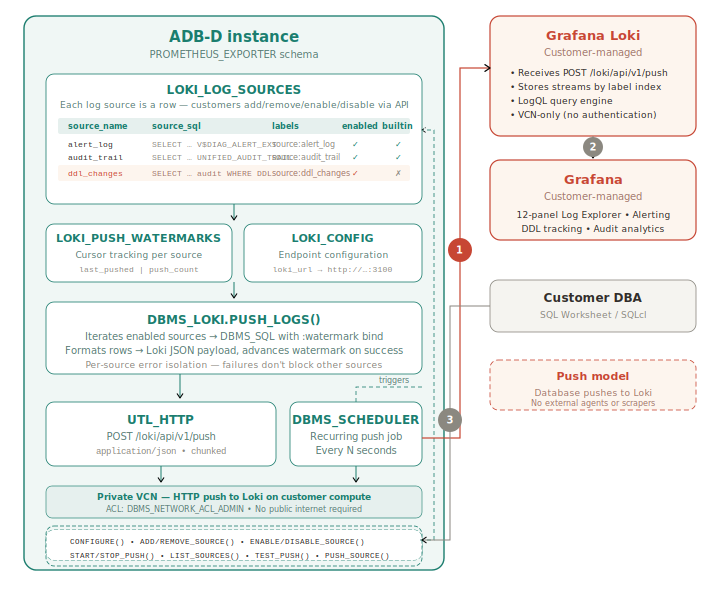

# Streaming ADB-D Logs to Grafana Loki with DBMS_LOKI

## Introduction

Oracle Autonomous AI Database - Dedicated (ADB-D) generates critical log streams — the **alert log** (database diagnostics) and the **unified audit trail** (security and compliance) — but these are accessible only via SQL or the OCI Logging service. In this workshop, you will build a native log push engine that continuously streams these logs to Grafana Loki, directly from inside the database — no external agents, no Promtail, no file scrapers.

By the end of this workshop, you will have a fully functional log observability pipeline: database logs pushed to Loki via PL/SQL and visualized in a Grafana Log Explorer dashboard — including a custom DDL change tracker you build yourself.

*Estimated Workshop Time:* 75 minutes

### Architecture

The key technical insight behind this workshop is that ADB-D can push its own logs using `UTL_HTTP` and `DBMS_SCHEDULER`. A PL/SQL package (`DBMS_LOKI`) iterates registered log sources, executes each SQL query with a watermark bind variable (ensuring only new entries are sent), formats the results as Loki JSON payloads, and POSTs them to Loki's push API. No endpoint is exposed on the database — the push model means no OAuth2 or authentication is needed.

> **Companion workshop:** This workshop covers **logs** (push model to Loki). For **metrics** (pull model via ORDS and Prometheus), see the companion workshop: [*Build a Prometheus-Compatible Telemetry Endpoint for ADB-D Using ORDS*](https://placeholder-url/prometheus-livelab).

### Objectives

In this workshop, you will learn how to:

- Install and configure Grafana Loki on a VCN compute instance
- Deploy the DBMS_LOKI PL/SQL package for watermark-based log push
- Configure and start continuous log streaming to Loki
- Build a Grafana Log Explorer dashboard for ADB-D
- Register a custom log source (DDL change tracking) using the self-service API
- Set up Grafana alerts on audit trail events

### Prerequisites

This lab assumes you have:

- An Oracle Autonomous AI Database - Dedicated (ADB-D) instance running in a private subnet
- ADMIN access to the ADB-D (via SQL Worksheet or SQLcl)
- A compute instance in the same VCN as your ADB-D (or you will create one in Lab 1)
- An OCI Bastion Service configured in the same VCN
- OCI CLI installed and configured on your local machine
- An SSH key pair (e.g., `~/.ssh/id_ed25519`)
- Basic familiarity with SQL, PL/SQL, and Linux command line

### Log Sources You Will Stream

| Source | Underlying View | What It Captures |
|---|---|---|
| Alert log | `V$DIAG_ALERT_EXT` | Partition maintenance, instance events, errors |
| Unified audit trail | `UNIFIED_AUDIT_TRAIL` | Logins, DDL, DML, privilege use, return codes |
| DDL changes (custom) | Filtered audit trail | CREATE/ALTER/DROP TABLE, INDEX, GRANT, REVOKE |

You may now **proceed to the next lab**.

## Acknowledgements

- **Author** - German Viscuso, Product Manager, Oracle Autonomous AI Database
- **Last Updated By/Date** - German Viscuso, April 2026
