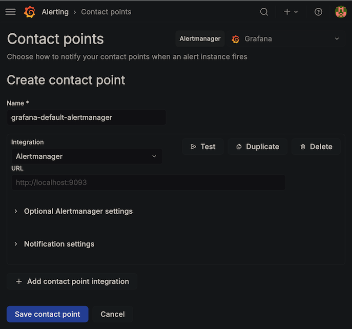
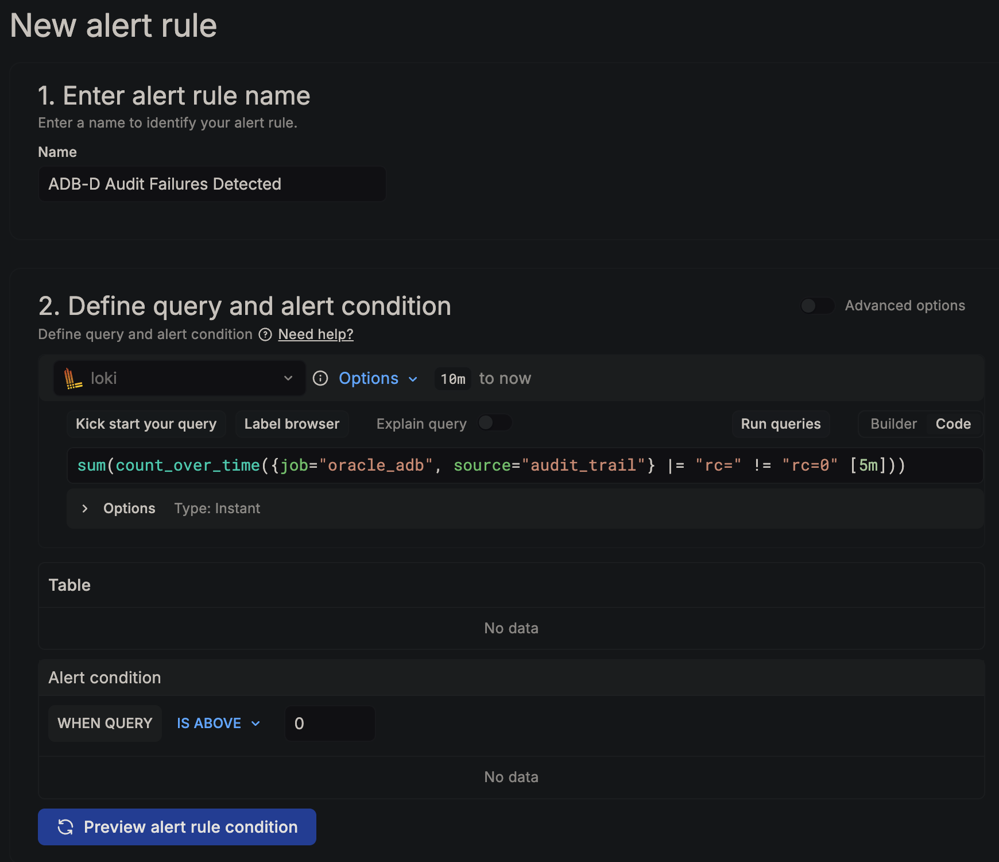
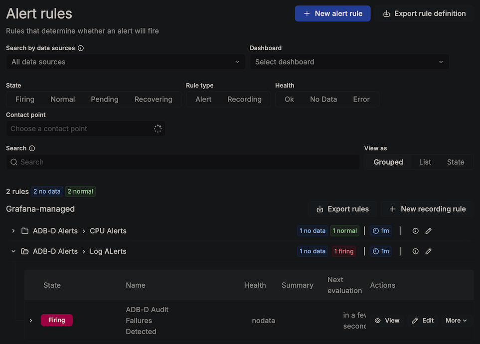

# Lab 6: Set Up a Grafana Alert on Audit Events

## Introduction

With your Log Explorer dashboard running, the final step is to configure alerting so you're notified when security-relevant events are detected in the audit trail. In this lab, you will create an audit failure alert using Grafana's built-in Alertmanager — you can later augment this with external notification channels or SMTP configuration.

*Estimated Lab Time:* 15 minutes

### Objectives

- Create a Grafana contact point using the built-in Alertmanager
- Configure a notification policy
- Create an alert rule for audit trail failures using LogQL
- Test the alert
- Explore additional alert ideas

### Prerequisites

- Completion of Lab 5
- Grafana accessible via bastion tunnel
- Loki push job running (`DBMS_LOKI_PUSH_JOB` active)

## Task 1: Create a Contact Point

Grafana requires at least one contact point before you can save an alert rule.

1. In Grafana, navigate to **Alerting** → **Contact points**.

2. Click **+ Add contact point**.

3. Configure:
   - **Name:** `grafana-default-alertmanager`
   - **Integration:** Select **Alertmanager**
   - Leave the URL as the default Grafana Alertmanager or manually enter `http://localhost:9093` if required

4. Click **Save contact point**.

    > **Note:** This uses Grafana's built-in Alertmanager, which surfaces alert state changes directly in the Grafana UI. For production, you can replace this with Email, Slack, PagerDuty, or any other supported integration.

    

## Task 2: Set the Default Notification Policy

1. Navigate to **Alerting** → **Notification policies**.

2. In **Search by contact point** select `grafana-default-alertmanager`.

3. If you navigate away and come back to the page you will notice a default policy has been set.

    

## Task 3: Create the Alert Rule

1. Navigate to **Alerting** → **Alert rules** → **+ New alert rule**.

2. **Rule name:** Enter `ADB-D Audit Failures Detected`.

3. **Define query and alert condition:**

    - **Data source:** Select your Loki data source
    - **Code:** Switch from **Builder** to **Code** and enter:
      ```
      sum(count_over_time({job="oracle_adb", source="audit_trail"} |= "rc=" != "rc=0" [5m]))
      ```
      This counts audit trail entries with non-zero return codes in the last 5 minutes.
    - Set **Alert Condition** to: **IS ABOVE** `0`
    - Click **Run queries** (`No data` is normal if you're not currently receiving audit failures)

    

4. **Set evaluation behavior:**

    - Click **+ New folder** → name it `ADB-D Alerts` (or select the folder if you already have it from a previous LiveLab)
    - Click **+ New evaluation group** → name it `Log Alerts`, set evaluation interval to `1m`
    - **Pending period:** Set to `0s` (fire immediately when audit failures are detected — unlike CPU alerts, security events should not wait for a sustained period)

5. **Configure notifications:**

    - Set **Contact point** to `grafana-default-alertmanager`

6. **Add custom annotation:**

    - Scroll all the way down and click on the **+ Add custom annotation** button
    - **Custom annotation name:** `Audit failures detected on ADB-D`
    - **Custom annotation content:** `One or more audit trail operations returned a non-zero return code. Check the Unified Audit Trail panel in the Log Explorer dashboard for details. Failed operations may indicate unauthorized access attempts, permission issues, or policy violations.`

7. Click **Save**.

## Task 4: Verify the Alert

1. Navigate to **Alerting** → **Alert rules**. You should see your `ADB-D Audit Failures Detected` rule with status **Normal** (green).

2. Generate a failed operation by attempting an unauthorized action. Connect as **PROMETHEUS_EXPORTER** in SQL Worksheet or SQLcl and run:

    ```sql
    
    SELECT * FROM sys.aud$ WHERE ROWNUM = 1;
    
    ```

    This should fail with `ORA-00942: table or view does not exist`. The failure is recorded in the unified audit trail with a non-zero return code.

3. Wait for the push cycle (up to 60 seconds) plus the audit trail flush delay (up to 30 seconds). Then wait for the next alert evaluation (up to 1 minute).

4. Navigate back to **Alerting** → **Alert rules**. You should see the alert transition from **Normal** → **Firing** (red), since the pending period is `0s`.

    

5. If you configured email or Slack instead of the built-in Alertmanager, you should receive a notification.

    > **Tip:** To reset the alert back to Normal, wait for the 5-minute window in the LogQL query to expire without new audit failures.

## Task 5: Explore Additional Alert Ideas (Optional)

You can create more alert rules using the same pattern. Here are some useful LogQL expressions:

| Alert | LogQL | Suggested Threshold |
|---|---|---|
| DDL on production schemas | `sum(count_over_time({job="oracle_adb", source="ddl_changes"} \|= "schema=PROD" [5m]))` | Above 0 |
| Failed login attempts | `sum(count_over_time({job="oracle_adb", source="audit_trail"} \|= "action=LOGON" \|= "rc=" != "rc=0" [5m]))` | Above 0 |
| High audit volume | `sum(count_over_time({job="oracle_adb", source="audit_trail"} [5m]))` | Above 100 |
| GRANT operations | `sum(count_over_time({job="oracle_adb", source="audit_trail"} \|= "action=GRANT" [5m]))` | Above 0 |

**Congratulations!** You have successfully built a complete log observability pipeline for Oracle Autonomous AI Database - Dedicated (ADB-D) — with live dashboards and proactive alerting — entirely from within the database using PL/SQL, UTL_HTTP, and DBMS_SCHEDULER. No external agents or exporters required.

## Summary

In this workshop, you learned how to:

- Install and configure Grafana Loki for database log ingestion
- Build a PL/SQL push engine that ships logs via UTL_HTTP with watermark-based incremental delivery
- Deploy DBMS_LOKI with built-in alert log and audit trail sources
- Register custom log sources (DDL tracking) using the self-service API
- Build a 12-panel Grafana Log Explorer dashboard for ADB-D
- Configure Grafana alerts for security monitoring on audit events

## Next Steps

- **Pair with DBMS_PROMETHEUS:** Complete the companion workshop to add metrics (CPU, sessions, wait classes, tablespace) to your Grafana setup for full LGTM stack coverage
- **Add more log sources:** Register custom sources for failed logins, application error tables, or specific schema auditing
- **Production alerting:** Configure Email, Slack, or PagerDuty contact points for real-time notifications
- **Production hardening:** Scope the UTL_HTTP ACL to the specific Loki host IP, configure TLS for cross-VCN deployments, and set up Grafana LDAP authentication

## Acknowledgements

- **Author** - German Viscuso, Product Manager, Oracle Autonomous AI Database
- **Last Updated By/Date** - German Viscuso, April 2026