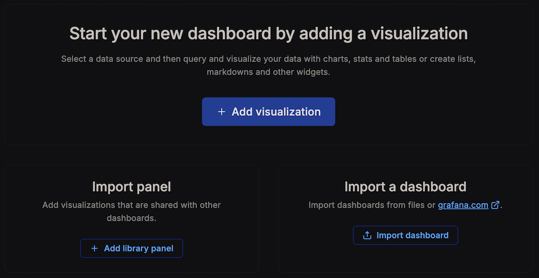
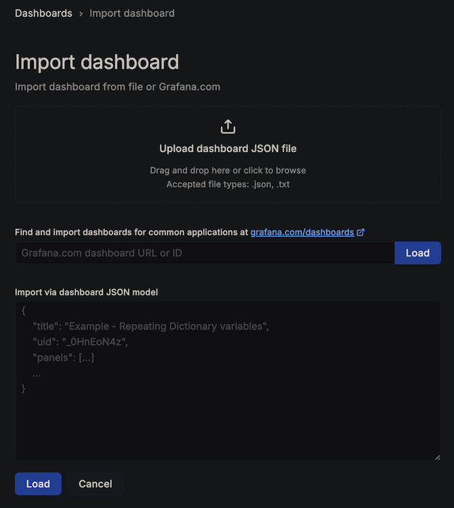
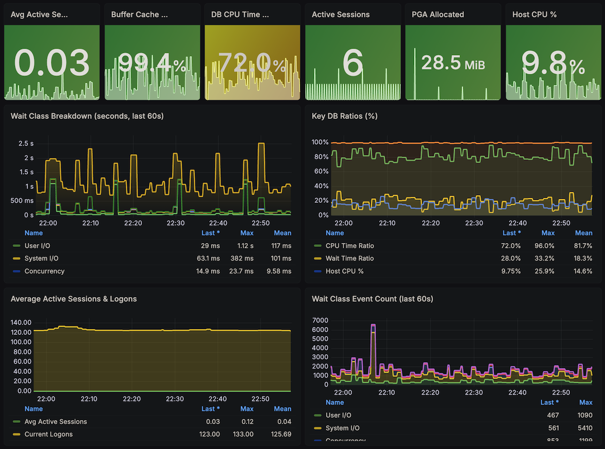
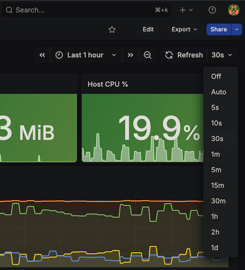

# Lab 5: Build a Grafana Dashboard

## Introduction

In this lab, you will import a pre-built 16-panel Grafana dashboard that visualizes all the metrics exposed by your ORDS Prometheus endpoint. The dashboard covers sessions, wait classes, system metrics, I/O, PGA memory, tablespace usage, and network throughput.

*Estimated Lab Time:* 10 minutes

### Objectives

- Import the dashboard JSON into Grafana
- Understand the dashboard panels and the PromQL queries behind them
- Customize the refresh interval

### Prerequisites

- Completion of Lab 4 (Grafana accessible at http://localhost:3000 with Prometheus data source configured)

## Task 1: Note Your Prometheus Data Source UID

1. In Grafana, navigate to **Connections** → **Data sources** → click on your **Prometheus** data source.

2. Look at the browser URL — it contains the data source UID (e.g., `http://localhost:3000/connections/datasources/edit/bfilxo88r6p6oc`). The last segment is your UID.

3. You will need to find-and-replace this value in the dashboard JSON before importing (change `<your_datasource_uid>` with your actual Prometheus datasource id).

## Task 2: Import the Dashboard JSON

1. Copy the ADB dashboard JSON specification:

    ```json
    {
    "annotations": {
        "list": [
        {
            "builtIn": 1,
            "datasource": { "type": "grafana", "uid": "-- Grafana --" },
            "enable": true,
            "hide": true,
            "iconColor": "rgba(0, 211, 255, 1)",
            "name": "Annotations & Alerts",
            "type": "dashboard"
        }
        ]
    },
    "editable": true,
    "fiscalYearStartMonth": 0,
    "graphTooltip": 1,
    "links": [],
    "panels": [
        {
        "datasource": { "type": "prometheus", "uid": "<your_datasource_uid>" },
        "fieldConfig": {
            "defaults": {
            "color": { "mode": "thresholds" },
            "mappings": [],
            "thresholds": { "mode": "absolute", "steps": [{ "color": "green", "value": null }, { "color": "yellow", "value": 2 }, { "color": "red", "value": 8 }] },
            "unit": "none",
            "decimals": 2
            },
            "overrides": []
        },
        "gridPos": { "h": 5, "w": 4, "x": 0, "y": 0 },
        "id": 1,
        "options": { "colorMode": "background", "graphMode": "area", "justifyMode": "auto", "orientation": "auto", "reduceOptions": { "calcs": ["lastNotNull"], "fields": "", "values": false }, "showPercentChange": false, "textMode": "auto", "wideLayout": true },
        "pluginVersion": "12.4.2",
        "targets": [{ "datasource": { "type": "prometheus", "uid": "<your_datasource_uid>" }, "expr": "oracledb_sysmetric{metric=\"Average Active Sessions\"}", "legendFormat": "AAS", "refId": "A" }],
        "title": "Avg Active Sessions",
        "type": "stat"
        },
        {
        "datasource": { "type": "prometheus", "uid": "<your_datasource_uid>" },
        "fieldConfig": {
            "defaults": {
            "color": { "mode": "thresholds" },
            "mappings": [],
            "thresholds": { "mode": "absolute", "steps": [{ "color": "red", "value": null }, { "color": "yellow", "value": 80 }, { "color": "green", "value": 95 }] },
            "unit": "percent",
            "decimals": 1
            },
            "overrides": []
        },
        "gridPos": { "h": 5, "w": 4, "x": 4, "y": 0 },
        "id": 2,
        "options": { "colorMode": "background", "graphMode": "area", "justifyMode": "auto", "orientation": "auto", "reduceOptions": { "calcs": ["lastNotNull"], "fields": "", "values": false }, "showPercentChange": false, "textMode": "auto", "wideLayout": true },
        "pluginVersion": "12.4.2",
        "targets": [{ "datasource": { "type": "prometheus", "uid": "<your_datasource_uid>" }, "expr": "oracledb_sysmetric{metric=\"Buffer Cache Hit Ratio\"}", "legendFormat": "Hit %", "refId": "A" }],
        "title": "Buffer Cache Hit %",
        "type": "stat"
        },
        {
        "datasource": { "type": "prometheus", "uid": "<your_datasource_uid>" },
        "fieldConfig": {
            "defaults": {
            "color": { "mode": "thresholds" },
            "mappings": [],
            "thresholds": { "mode": "absolute", "steps": [{ "color": "red", "value": null }, { "color": "yellow", "value": 50 }, { "color": "green", "value": 80 }] },
            "unit": "percent",
            "decimals": 1
            },
            "overrides": []
        },
        "gridPos": { "h": 5, "w": 4, "x": 8, "y": 0 },
        "id": 3,
        "options": { "colorMode": "background", "graphMode": "area", "justifyMode": "auto", "orientation": "auto", "reduceOptions": { "calcs": ["lastNotNull"], "fields": "", "values": false }, "showPercentChange": false, "textMode": "auto", "wideLayout": true },
        "pluginVersion": "12.4.2",
        "targets": [{ "datasource": { "type": "prometheus", "uid": "<your_datasource_uid>" }, "expr": "oracledb_sysmetric{metric=\"Database CPU Time Ratio\"}", "legendFormat": "CPU %", "refId": "A" }],
        "title": "DB CPU Time Ratio",
        "type": "stat"
        },
        {
        "datasource": { "type": "prometheus", "uid": "<your_datasource_uid>" },
        "fieldConfig": {
            "defaults": {
            "color": { "mode": "thresholds" },
            "mappings": [],
            "thresholds": { "mode": "absolute", "steps": [{ "color": "green", "value": null }, { "color": "yellow", "value": 10 }, { "color": "red", "value": 50 }] },
            "unit": "none"
            },
            "overrides": []
        },
        "gridPos": { "h": 5, "w": 4, "x": 12, "y": 0 },
        "id": 4,
        "options": { "colorMode": "background", "graphMode": "area", "justifyMode": "auto", "orientation": "auto", "reduceOptions": { "calcs": ["lastNotNull"], "fields": "", "values": false }, "showPercentChange": false, "textMode": "auto", "wideLayout": true },
        "pluginVersion": "12.4.2",
        "targets": [{ "datasource": { "type": "prometheus", "uid": "<your_datasource_uid>" }, "expr": "sum(oracledb_sessions_total)", "legendFormat": "Total", "refId": "A" }],
        "title": "Active Sessions",
        "type": "stat"
        },
        {
        "datasource": { "type": "prometheus", "uid": "<your_datasource_uid>" },
        "fieldConfig": {
            "defaults": {
            "color": { "mode": "thresholds" },
            "mappings": [],
            "thresholds": { "mode": "absolute", "steps": [{ "color": "green", "value": null }, { "color": "yellow", "value": 536870912 }, { "color": "red", "value": 1073741824 }] },
            "unit": "bytes"
            },
            "overrides": []
        },
        "gridPos": { "h": 5, "w": 4, "x": 16, "y": 0 },
        "id": 5,
        "options": { "colorMode": "background", "graphMode": "area", "justifyMode": "auto", "orientation": "auto", "reduceOptions": { "calcs": ["lastNotNull"], "fields": "", "values": false }, "showPercentChange": false, "textMode": "auto", "wideLayout": true },
        "pluginVersion": "12.4.2",
        "targets": [{ "datasource": { "type": "prometheus", "uid": "<your_datasource_uid>" }, "expr": "oracledb_pga_bytes{stat=\"total PGA allocated\"}", "legendFormat": "PGA", "refId": "A" }],
        "title": "PGA Allocated",
        "type": "stat"
        },
        {
        "datasource": { "type": "prometheus", "uid": "<your_datasource_uid>" },
        "fieldConfig": {
            "defaults": {
            "color": { "mode": "thresholds" },
            "mappings": [],
            "thresholds": { "mode": "absolute", "steps": [{ "color": "green", "value": null }, { "color": "yellow", "value": 20 }, { "color": "red", "value": 50 }] },
            "unit": "percent",
            "decimals": 1
            },
            "overrides": []
        },
        "gridPos": { "h": 5, "w": 4, "x": 20, "y": 0 },
        "id": 6,
        "options": { "colorMode": "background", "graphMode": "area", "justifyMode": "auto", "orientation": "auto", "reduceOptions": { "calcs": ["lastNotNull"], "fields": "", "values": false }, "showPercentChange": false, "textMode": "auto", "wideLayout": true },
        "pluginVersion": "12.4.2",
        "targets": [{ "datasource": { "type": "prometheus", "uid": "<your_datasource_uid>" }, "expr": "oracledb_sysmetric{metric=\"Host CPU Utilization (%)\"}", "legendFormat": "CPU %", "refId": "A" }],
        "title": "Host CPU %",
        "type": "stat"
        },
        {
        "datasource": { "type": "prometheus", "uid": "<your_datasource_uid>" },
        "fieldConfig": {
            "defaults": {
            "color": { "mode": "palette-classic" },
            "custom": { "axisBorderShow": false, "axisCenteredZero": false, "axisColorMode": "text", "axisLabel": "", "axisPlacement": "auto", "barAlignment": 0, "barWidthFactor": 0.6, "drawStyle": "line", "fillOpacity": 30, "gradientMode": "opacity", "hideFrom": { "legend": false, "tooltip": false, "viz": false }, "insertNulls": false, "lineInterpolation": "smooth", "lineWidth": 2, "pointSize": 5, "scaleDistribution": { "type": "linear" }, "showPoints": "never", "showValues": false, "spanNulls": true, "stacking": { "group": "A", "mode": "normal" }, "thresholdsStyle": { "mode": "off" } },
            "mappings": [],
            "thresholds": { "mode": "absolute", "steps": [{ "color": "green", "value": null }] },
            "unit": "s"
            },
            "overrides": []
        },
        "gridPos": { "h": 9, "w": 12, "x": 0, "y": 5 },
        "id": 10,
        "options": { "legend": { "calcs": ["lastNotNull", "max", "mean"], "displayMode": "table", "placement": "bottom", "showLegend": true }, "tooltip": { "hideZeros": true, "mode": "multi", "sort": "desc" } },
        "pluginVersion": "12.4.2",
        "targets": [
            { "datasource": { "type": "prometheus", "uid": "<your_datasource_uid>" }, "expr": "oracledb_wait_class_time_secs{wait_class=\"User I/O\"}", "legendFormat": "User I/O", "refId": "A" },
            { "datasource": { "type": "prometheus", "uid": "<your_datasource_uid>" }, "expr": "oracledb_wait_class_time_secs{wait_class=\"System I/O\"}", "legendFormat": "System I/O", "refId": "B" },
            { "datasource": { "type": "prometheus", "uid": "<your_datasource_uid>" }, "expr": "oracledb_wait_class_time_secs{wait_class=\"Concurrency\"}", "legendFormat": "Concurrency", "refId": "C" },
            { "datasource": { "type": "prometheus", "uid": "<your_datasource_uid>" }, "expr": "oracledb_wait_class_time_secs{wait_class=\"Application\"}", "legendFormat": "Application", "refId": "D" },
            { "datasource": { "type": "prometheus", "uid": "<your_datasource_uid>" }, "expr": "oracledb_wait_class_time_secs{wait_class=\"Commit\"}", "legendFormat": "Commit", "refId": "E" },
            { "datasource": { "type": "prometheus", "uid": "<your_datasource_uid>" }, "expr": "oracledb_wait_class_time_secs{wait_class=\"Network\"}", "legendFormat": "Network", "refId": "F" },
            { "datasource": { "type": "prometheus", "uid": "<your_datasource_uid>" }, "expr": "oracledb_wait_class_time_secs{wait_class=\"Configuration\"}", "legendFormat": "Configuration", "refId": "G" },
            { "datasource": { "type": "prometheus", "uid": "<your_datasource_uid>" }, "expr": "oracledb_wait_class_time_secs{wait_class=\"Other\"}", "legendFormat": "Other", "refId": "H" }
        ],
        "title": "Wait Class Breakdown (seconds, last 60s)",
        "type": "timeseries"
        },
        {
        "datasource": { "type": "prometheus", "uid": "<your_datasource_uid>" },
        "fieldConfig": {
            "defaults": {
            "color": { "mode": "palette-classic" },
            "custom": { "axisBorderShow": false, "axisCenteredZero": false, "axisColorMode": "text", "axisLabel": "", "axisPlacement": "auto", "barAlignment": 0, "barWidthFactor": 0.6, "drawStyle": "line", "fillOpacity": 10, "gradientMode": "none", "hideFrom": { "legend": false, "tooltip": false, "viz": false }, "insertNulls": false, "lineInterpolation": "smooth", "lineWidth": 2, "pointSize": 5, "scaleDistribution": { "type": "linear" }, "showPoints": "never", "showValues": false, "spanNulls": true, "stacking": { "group": "A", "mode": "none" }, "thresholdsStyle": { "mode": "off" } },
            "mappings": [],
            "thresholds": { "mode": "absolute", "steps": [{ "color": "green", "value": null }] },
            "unit": "percent"
            },
            "overrides": []
        },
        "gridPos": { "h": 9, "w": 12, "x": 12, "y": 5 },
        "id": 11,
        "options": { "legend": { "calcs": ["lastNotNull", "max", "mean"], "displayMode": "table", "placement": "bottom", "showLegend": true }, "tooltip": { "hideZeros": false, "mode": "multi", "sort": "none" } },
        "pluginVersion": "12.4.2",
        "targets": [
            { "datasource": { "type": "prometheus", "uid": "<your_datasource_uid>" }, "expr": "oracledb_sysmetric{metric=\"Database CPU Time Ratio\"}", "legendFormat": "CPU Time Ratio", "refId": "A" },
            { "datasource": { "type": "prometheus", "uid": "<your_datasource_uid>" }, "expr": "oracledb_sysmetric{metric=\"Database Wait Time Ratio\"}", "legendFormat": "Wait Time Ratio", "refId": "B" },
            { "datasource": { "type": "prometheus", "uid": "<your_datasource_uid>" }, "expr": "oracledb_sysmetric{metric=\"Host CPU Utilization (%)\"}", "legendFormat": "Host CPU %", "refId": "C" },
            { "datasource": { "type": "prometheus", "uid": "<your_datasource_uid>" }, "expr": "oracledb_sysmetric{metric=\"Buffer Cache Hit Ratio\"}", "legendFormat": "Buffer Cache Hit %", "refId": "D" }
        ],
        "title": "Key DB Ratios (%)",
        "type": "timeseries"
        },
        {
        "datasource": { "type": "prometheus", "uid": "<your_datasource_uid>" },
        "fieldConfig": {
            "defaults": {
            "color": { "mode": "palette-classic" },
            "custom": { "axisBorderShow": false, "axisCenteredZero": false, "axisColorMode": "text", "axisLabel": "", "axisPlacement": "auto", "barAlignment": 0, "barWidthFactor": 0.6, "drawStyle": "line", "fillOpacity": 20, "gradientMode": "none", "hideFrom": { "legend": false, "tooltip": false, "viz": false }, "insertNulls": false, "lineInterpolation": "smooth", "lineWidth": 2, "pointSize": 5, "scaleDistribution": { "type": "linear" }, "showPoints": "never", "showValues": false, "spanNulls": true, "stacking": { "group": "A", "mode": "none" }, "thresholdsStyle": { "mode": "off" } },
            "mappings": [],
            "thresholds": { "mode": "absolute", "steps": [{ "color": "green", "value": null }] },
            "unit": "none",
            "decimals": 2
            },
            "overrides": []
        },
        "gridPos": { "h": 8, "w": 12, "x": 0, "y": 14 },
        "id": 15,
        "options": { "legend": { "calcs": ["lastNotNull", "max", "mean"], "displayMode": "table", "placement": "bottom", "showLegend": true }, "tooltip": { "hideZeros": false, "mode": "multi", "sort": "none" } },
        "pluginVersion": "12.4.2",
        "targets": [
            { "datasource": { "type": "prometheus", "uid": "<your_datasource_uid>" }, "expr": "oracledb_sysmetric{metric=\"Average Active Sessions\"}", "legendFormat": "Avg Active Sessions", "refId": "A" },
            { "datasource": { "type": "prometheus", "uid": "<your_datasource_uid>" }, "expr": "oracledb_sysmetric{metric=\"Current Logons Count\"}", "legendFormat": "Current Logons", "refId": "B" }
        ],
        "title": "Average Active Sessions & Logons",
        "type": "timeseries"
        },
        {
        "datasource": { "type": "prometheus", "uid": "<your_datasource_uid>" },
        "fieldConfig": {
            "defaults": {
            "color": { "mode": "palette-classic" },
            "custom": { "axisBorderShow": false, "axisCenteredZero": false, "axisColorMode": "text", "axisLabel": "", "axisPlacement": "auto", "barAlignment": 0, "barWidthFactor": 0.6, "drawStyle": "line", "fillOpacity": 20, "gradientMode": "none", "hideFrom": { "legend": false, "tooltip": false, "viz": false }, "insertNulls": false, "lineInterpolation": "smooth", "lineWidth": 2, "pointSize": 5, "scaleDistribution": { "type": "linear" }, "showPoints": "never", "showValues": false, "spanNulls": true, "stacking": { "group": "A", "mode": "normal" }, "thresholdsStyle": { "mode": "off" } },
            "mappings": [],
            "thresholds": { "mode": "absolute", "steps": [{ "color": "green", "value": null }] },
            "unit": "none"
            },
            "overrides": []
        },
        "gridPos": { "h": 8, "w": 12, "x": 12, "y": 14 },
        "id": 16,
        "options": { "legend": { "calcs": ["lastNotNull", "max"], "displayMode": "table", "placement": "bottom", "showLegend": true }, "tooltip": { "hideZeros": true, "mode": "multi", "sort": "desc" } },
        "pluginVersion": "12.4.2",
        "targets": [
            { "datasource": { "type": "prometheus", "uid": "<your_datasource_uid>" }, "expr": "oracledb_wait_class_wait_count{wait_class=\"User I/O\"}", "legendFormat": "User I/O", "refId": "A" },
            { "datasource": { "type": "prometheus", "uid": "<your_datasource_uid>" }, "expr": "oracledb_wait_class_wait_count{wait_class=\"System I/O\"}", "legendFormat": "System I/O", "refId": "B" },
            { "datasource": { "type": "prometheus", "uid": "<your_datasource_uid>" }, "expr": "oracledb_wait_class_wait_count{wait_class=\"Concurrency\"}", "legendFormat": "Concurrency", "refId": "C" },
            { "datasource": { "type": "prometheus", "uid": "<your_datasource_uid>" }, "expr": "oracledb_wait_class_wait_count{wait_class=\"Application\"}", "legendFormat": "Application", "refId": "D" },
            { "datasource": { "type": "prometheus", "uid": "<your_datasource_uid>" }, "expr": "oracledb_wait_class_wait_count{wait_class=\"Commit\"}", "legendFormat": "Commit", "refId": "E" },
            { "datasource": { "type": "prometheus", "uid": "<your_datasource_uid>" }, "expr": "oracledb_wait_class_wait_count{wait_class=\"Network\"}", "legendFormat": "Network", "refId": "F" }
        ],
        "title": "Wait Class Event Count (last 60s)",
        "type": "timeseries"
        },
        {
        "datasource": { "type": "prometheus", "uid": "<your_datasource_uid>" },
        "fieldConfig": {
            "defaults": {
            "color": { "mode": "palette-classic" },
            "custom": { "axisBorderShow": false, "axisCenteredZero": false, "axisColorMode": "text", "axisLabel": "", "axisPlacement": "auto", "barAlignment": 0, "barWidthFactor": 0.6, "drawStyle": "line", "fillOpacity": 10, "gradientMode": "none", "hideFrom": { "legend": false, "tooltip": false, "viz": false }, "insertNulls": false, "lineInterpolation": "smooth", "lineWidth": 2, "pointSize": 5, "scaleDistribution": { "type": "linear" }, "showPoints": "never", "showValues": false, "spanNulls": true, "stacking": { "group": "A", "mode": "none" }, "thresholdsStyle": { "mode": "off" } },
            "mappings": [],
            "thresholds": { "mode": "absolute", "steps": [{ "color": "green", "value": null }] },
            "unit": "ops",
            "decimals": 1
            },
            "overrides": []
        },
        "gridPos": { "h": 8, "w": 12, "x": 0, "y": 22 },
        "id": 20,
        "options": { "legend": { "calcs": ["lastNotNull", "max", "mean"], "displayMode": "table", "placement": "bottom", "showLegend": true }, "tooltip": { "hideZeros": false, "mode": "multi", "sort": "none" } },
        "pluginVersion": "12.4.2",
        "targets": [
            { "datasource": { "type": "prometheus", "uid": "<your_datasource_uid>" }, "expr": "oracledb_sysmetric{metric=\"Executions Per Sec\"}", "legendFormat": "Executions/s", "refId": "A" },
            { "datasource": { "type": "prometheus", "uid": "<your_datasource_uid>" }, "expr": "oracledb_sysmetric{metric=\"User Commits Per Sec\"}", "legendFormat": "Commits/s", "refId": "B" },
            { "datasource": { "type": "prometheus", "uid": "<your_datasource_uid>" }, "expr": "oracledb_sysmetric{metric=\"User Calls Per Sec\"}", "legendFormat": "User Calls/s", "refId": "C" },
            { "datasource": { "type": "prometheus", "uid": "<your_datasource_uid>" }, "expr": "oracledb_sysmetric{metric=\"Hard Parse Count Per Sec\"}", "legendFormat": "Hard Parses/s", "refId": "D" }
        ],
        "title": "Throughput — Oracle Real-Time Rates",
        "type": "timeseries"
        },
        {
        "datasource": { "type": "prometheus", "uid": "<your_datasource_uid>" },
        "fieldConfig": {
            "defaults": {
            "color": { "mode": "palette-classic" },
            "custom": { "axisBorderShow": false, "axisCenteredZero": false, "axisColorMode": "text", "axisLabel": "", "axisPlacement": "auto", "barAlignment": 0, "barWidthFactor": 0.6, "drawStyle": "line", "fillOpacity": 10, "gradientMode": "none", "hideFrom": { "legend": false, "tooltip": false, "viz": false }, "insertNulls": false, "lineInterpolation": "smooth", "lineWidth": 2, "pointSize": 5, "scaleDistribution": { "type": "linear" }, "showPoints": "never", "showValues": false, "spanNulls": true, "stacking": { "group": "A", "mode": "none" }, "thresholdsStyle": { "mode": "off" } },
            "mappings": [],
            "thresholds": { "mode": "absolute", "steps": [{ "color": "green", "value": null }] },
            "unit": "ops",
            "decimals": 1
            },
            "overrides": []
        },
        "gridPos": { "h": 8, "w": 12, "x": 12, "y": 22 },
        "id": 21,
        "options": { "legend": { "calcs": ["lastNotNull", "max", "mean"], "displayMode": "table", "placement": "bottom", "showLegend": true }, "tooltip": { "hideZeros": false, "mode": "multi", "sort": "none" } },
        "pluginVersion": "12.4.2",
        "targets": [
            { "datasource": { "type": "prometheus", "uid": "<your_datasource_uid>" }, "expr": "oracledb_sysmetric{metric=\"Physical Reads Per Sec\"}", "legendFormat": "Physical Reads/s", "refId": "A" },
            { "datasource": { "type": "prometheus", "uid": "<your_datasource_uid>" }, "expr": "oracledb_sysmetric{metric=\"Physical Writes Per Sec\"}", "legendFormat": "Physical Writes/s", "refId": "B" },
            { "datasource": { "type": "prometheus", "uid": "<your_datasource_uid>" }, "expr": "oracledb_sysmetric{metric=\"Logical Reads Per Sec\"}", "legendFormat": "Logical Reads/s", "refId": "C" },
            { "datasource": { "type": "prometheus", "uid": "<your_datasource_uid>" }, "expr": "oracledb_sysmetric{metric=\"Redo Generated Per Sec\"}", "legendFormat": "Redo/s", "refId": "D" }
        ],
        "title": "I/O — Oracle Real-Time Rates",
        "type": "timeseries"
        },
        {
        "datasource": { "type": "prometheus", "uid": "<your_datasource_uid>" },
        "fieldConfig": {
            "defaults": {
            "color": { "mode": "palette-classic" },
            "custom": { "axisBorderShow": false, "axisCenteredZero": false, "axisColorMode": "text", "axisLabel": "", "axisPlacement": "auto", "barAlignment": 0, "barWidthFactor": 0.6, "drawStyle": "line", "fillOpacity": 20, "gradientMode": "none", "hideFrom": { "legend": false, "tooltip": false, "viz": false }, "insertNulls": false, "lineInterpolation": "smooth", "lineWidth": 2, "pointSize": 5, "scaleDistribution": { "type": "linear" }, "showPoints": "never", "showValues": false, "spanNulls": true, "stacking": { "group": "A", "mode": "normal" }, "thresholdsStyle": { "mode": "off" } },
            "mappings": [],
            "thresholds": { "mode": "absolute", "steps": [{ "color": "green", "value": null }] },
            "unit": "none"
            },
            "overrides": []
        },
        "gridPos": { "h": 8, "w": 12, "x": 0, "y": 30 },
        "id": 25,
        "options": { "legend": { "calcs": ["lastNotNull", "max"], "displayMode": "table", "placement": "bottom", "showLegend": true }, "tooltip": { "hideZeros": false, "mode": "multi", "sort": "none" } },
        "pluginVersion": "12.4.2",
        "targets": [{ "datasource": { "type": "prometheus", "uid": "<your_datasource_uid>" }, "expr": "oracledb_sessions_total", "legendFormat": "{{status}} ({{type}})", "refId": "A" }],
        "title": "Sessions by Status",
        "type": "timeseries"
        },
        {
        "datasource": { "type": "prometheus", "uid": "<your_datasource_uid>" },
        "fieldConfig": {
            "defaults": {
            "color": { "mode": "palette-classic" },
            "custom": { "axisBorderShow": false, "axisCenteredZero": false, "axisColorMode": "text", "axisLabel": "", "axisPlacement": "auto", "barAlignment": 0, "barWidthFactor": 0.6, "drawStyle": "line", "fillOpacity": 10, "gradientMode": "none", "hideFrom": { "legend": false, "tooltip": false, "viz": false }, "insertNulls": false, "lineInterpolation": "smooth", "lineWidth": 2, "pointSize": 5, "scaleDistribution": { "type": "linear" }, "showPoints": "never", "showValues": false, "spanNulls": true, "stacking": { "group": "A", "mode": "none" }, "thresholdsStyle": { "mode": "off" } },
            "mappings": [],
            "thresholds": { "mode": "absolute", "steps": [{ "color": "green", "value": null }] },
            "unit": "bytes"
            },
            "overrides": []
        },
        "gridPos": { "h": 8, "w": 12, "x": 12, "y": 30 },
        "id": 26,
        "options": { "legend": { "calcs": ["lastNotNull", "max"], "displayMode": "table", "placement": "bottom", "showLegend": true }, "tooltip": { "hideZeros": false, "mode": "multi", "sort": "none" } },
        "pluginVersion": "12.4.2",
        "targets": [
            { "datasource": { "type": "prometheus", "uid": "<your_datasource_uid>" }, "expr": "oracledb_pga_bytes{stat=\"total PGA allocated\"}", "legendFormat": "Allocated", "refId": "A" },
            { "datasource": { "type": "prometheus", "uid": "<your_datasource_uid>" }, "expr": "oracledb_pga_bytes{stat=\"total PGA inuse\"}", "legendFormat": "In Use", "refId": "B" },
            { "datasource": { "type": "prometheus", "uid": "<your_datasource_uid>" }, "expr": "oracledb_pga_bytes{stat=\"maximum PGA allocated\"}", "legendFormat": "Max (watermark)", "refId": "C" }
        ],
        "title": "PGA Memory Over Time",
        "type": "timeseries"
        },
        {
        "datasource": { "type": "prometheus", "uid": "<your_datasource_uid>" },
        "fieldConfig": {
            "defaults": {
            "color": { "mode": "thresholds" },
            "mappings": [],
            "thresholds": { "mode": "absolute", "steps": [{ "color": "green", "value": null }, { "color": "yellow", "value": 70 }, { "color": "red", "value": 90 }] },
            "unit": "percent",
            "min": 0,
            "max": 100
            },
            "overrides": []
        },
        "gridPos": { "h": 8, "w": 12, "x": 0, "y": 38 },
        "id": 30,
        "options": { "displayMode": "gradient", "minVizHeight": 10, "minVizWidth": 0, "namePlacement": "auto", "orientation": "horizontal", "reduceOptions": { "calcs": ["lastNotNull"], "fields": "", "values": false }, "showUnfilled": true, "sizing": "auto", "valueMode": "color" },
        "pluginVersion": "12.4.2",
        "targets": [{ "datasource": { "type": "prometheus", "uid": "<your_datasource_uid>" }, "expr": "oracledb_tablespace_used_pct", "legendFormat": "{{tablespace}}", "refId": "A" }],
        "title": "Tablespace Usage (%)",
        "type": "bargauge"
        },
        {
        "datasource": { "type": "prometheus", "uid": "<your_datasource_uid>" },
        "fieldConfig": {
            "defaults": {
            "color": { "mode": "palette-classic" },
            "custom": { "axisBorderShow": false, "axisCenteredZero": false, "axisColorMode": "text", "axisLabel": "", "axisPlacement": "auto", "barAlignment": 0, "barWidthFactor": 0.6, "drawStyle": "line", "fillOpacity": 15, "gradientMode": "none", "hideFrom": { "legend": false, "tooltip": false, "viz": false }, "insertNulls": false, "lineInterpolation": "smooth", "lineWidth": 2, "pointSize": 5, "scaleDistribution": { "type": "linear" }, "showPoints": "never", "showValues": false, "spanNulls": true, "stacking": { "group": "A", "mode": "none" }, "thresholdsStyle": { "mode": "off" } },
            "mappings": [],
            "thresholds": { "mode": "absolute", "steps": [{ "color": "green", "value": null }] },
            "unit": "Bps"
            },
            "overrides": []
        },
        "gridPos": { "h": 8, "w": 12, "x": 12, "y": 38 },
        "id": 31,
        "options": { "legend": { "calcs": ["lastNotNull", "max", "mean"], "displayMode": "table", "placement": "bottom", "showLegend": true }, "tooltip": { "hideZeros": false, "mode": "multi", "sort": "none" } },
        "pluginVersion": "12.4.2",
        "targets": [
            { "datasource": { "type": "prometheus", "uid": "<your_datasource_uid>" }, "expr": "oracledb_sysmetric{metric=\"Network Traffic Volume Per Sec\"}", "legendFormat": "Network Vol/s (sysmetric)", "refId": "A" },
            { "datasource": { "type": "prometheus", "uid": "<your_datasource_uid>" }, "expr": "rate(oracledb_sysstat{stat=\"bytes sent via SQL*Net to client\"}[5m])", "legendFormat": "SQL*Net Sent/s", "refId": "B" },
            { "datasource": { "type": "prometheus", "uid": "<your_datasource_uid>" }, "expr": "rate(oracledb_sysstat{stat=\"bytes received via SQL*Net from client\"}[5m])", "legendFormat": "SQL*Net Received/s", "refId": "C" }
        ],
        "title": "Network Throughput",
        "type": "timeseries"
        }
    ],
    "preload": false,
    "refresh": "30s",
    "schemaVersion": 42,
    "tags": ["oracle", "adb", "prometheus", "ords"],
    "templating": { "list": [] },
    "time": { "from": "now-1h", "to": "now" },
    "timepicker": {},
    "timezone": "browser",
    "title": "Oracle ADB-D — Live Telemetry",
    "uid": "oracle-adb-live-v2",
    "version": 1,
    "weekStart": ""
    }
    ```

    > **Important:** Don't forget to replace all instances of `<your_datasource_uid>` with your actual Prometheus datasource id

## Task 3: Import the Dashboard

1. In Grafana, navigate to **Dashboards** → **New** → **Import** and click on **Import dashboard**.

    

2. Paste the JSON code in the **Import via dashboard JSON model** window.

3. Select your Prometheus data source in the dropdown if prompted.

4. Click the **Load** button below the import window.

    

## Task 4: Explore the Dashboard

The dashboard is organized into 6 rows with 16 panels.

   

### Row 1: KPI Cards

| Panel | PromQL | What It Shows |
|---|---|---|
| **Avg Active Sessions** | `oracledb_sysmetric{metric="Average Active Sessions"}` | The golden DBA metric — how many sessions are actively consuming CPU or waiting. Thresholds: green < 2, yellow < 8, red >= 8 |
| **Buffer Cache Hit %** | `oracledb_sysmetric{metric="Buffer Cache Hit Ratio"}` | How efficiently the buffer cache serves reads. Thresholds: red < 80%, yellow < 95%, green >= 95% |
| **DB CPU Time Ratio** | `oracledb_sysmetric{metric="Database CPU Time Ratio"}` | Percentage of DB time spent on CPU (vs waiting). Higher is better |
| **Active Sessions** | `sum(oracledb_sessions_total)` | Total session count across all statuses |
| **PGA Allocated** | `oracledb_pga_bytes{stat="total PGA allocated"}` | Current PGA memory allocation |
| **Host CPU %** | `oracledb_sysmetric{metric="Host CPU Utilization (%)"}` | Overall host CPU utilization |

### Row 2: Wait Classes and Ratios

| Panel | Description |
|---|---|
| **Wait Class Breakdown** | Stacked area chart showing wait time per class (User I/O, System I/O, Concurrency, Application, Commit, Network, etc.) over time. This is the ADB-D equivalent of an ASH wait class chart |
| **Key DB Ratios** | CPU Time Ratio, Wait Time Ratio, Host CPU %, and Buffer Cache Hit % trended over time |

### Row 3: AAS and Wait Counts

| Panel | Description |
|---|---|
| **Average Active Sessions & Logons** | AAS and Current Logons trended over time |
| **Wait Class Event Count** | Stacked chart of wait event counts per class |

### Row 4: Throughput and I/O

| Panel | Description |
|---|---|
| **Throughput (Oracle Rates)** | Executions/s, Commits/s, User Calls/s, Hard Parses/s — computed by Oracle's own 60-second interval engine |
| **I/O (Oracle Rates)** | Physical Reads/s, Physical Writes/s, Logical Reads/s, Redo Generated/s |

### Row 5: Sessions and Memory

| Panel | Description |
|---|---|
| **Sessions by Status** | Stacked area showing ACTIVE vs INACTIVE user sessions |
| **PGA Memory Over Time** | Three lines: Allocated, In Use, and Max Watermark |

### Row 6: Storage and Network

| Panel | Description |
|---|---|
| **Tablespace Usage (%)** | Horizontal bar gauge per tablespace with green/yellow/red thresholds at 70%/90% |
| **Network Throughput** | SQL*Net bytes sent/received and sysmetric network volume |

## Task 5: Customize the Refresh Interval

1. In the top-right corner of the dashboard, click the refresh interval dropdown (default: **30s**).

2. Choose your preferred interval. Options include 10s, 30s, 1m, 5m, etc.

    

    > **Tip:** The Grafana refresh interval can be independent of the Prometheus scrape interval. Making Grafana refresh faster than 30 seconds won't show new data — we configured Prometheus to only scrape every 30 seconds.

3. To change the Prometheus scrape interval, edit `/etc/prometheus/prometheus.yml` on the compute instance and restart Prometheus:

    ```bash
    sudo vi /etc/prometheus/prometheus.yml
    # Change scrape_interval to desired value
    sudo systemctl restart prometheus
    ```

    > **Important:** 30 seconds is a good balance to avoid stressing the database. Lower values are not recommended.

## Task 6: Create Custom Panels (Optional)

You can create additional panels using any of the exposed metrics. Here are some useful PromQL queries to try:

| Query | Description |
|---|---|
| `rate(oracledb_sysstat{stat="user commits"}[5m])` | Commit rate computed by Prometheus (alternative to Oracle's rate) |
| `oracledb_sysstat{stat="physical reads"} / oracledb_sysstat{stat="session logical reads"} * 100` | Buffer cache miss ratio from raw counters |
| `oracledb_wait_class_time_secs{wait_class="User I/O"} / ignoring(wait_class) sum(oracledb_wait_class_time_secs) * 100` | User I/O as percentage of total wait time |

You may now **proceed to the next and final lab**.

## Acknowledgements

- **Author** - German Viscuso, Product Manager, Oracle Autonomous AI Database
- **Last Updated By/Date** - German Viscuso, April 2026
