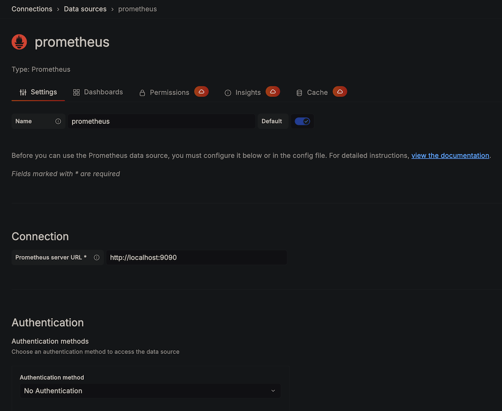
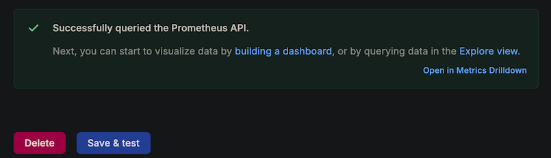

# Lab 4: Deploy Prometheus and Grafana

## Introduction

In this lab, you will launch a compute instance in the same VCN as your Autonomous AI Database - Dedicated (ADB-D), install Prometheus and Grafana, and configure Prometheus to scrape your ORDS metrics endpoint using OAuth2 authentication.

*Estimated Lab Time:* 30 minutes

### Objectives

- Launch an OCI Compute instance in the ADB-D subnet
- Install and configure Prometheus with OAuth2 scraping
- Install Grafana
- Access Grafana from your local machine via bastion tunnel

### Prerequisites

- Completion of Lab 3
- OCI CLI installed and configured
- SSH key pair available and registered in OCI

## Task 1: Launch a Compute Instance

1. Find the latest Oracle Linux 8 image OCID for your region:

    ```bash
    oci compute image list \
      --compartment-id <your_compartment_ocid> \
      --shape VM.Standard.E4.Flex \
      --sort-by TIMECREATED --sort-order DESC --limit 1 \
      --query 'data[0].id' --raw-output
    ```

    > **Replace** `<your_compartment_ocid>` above.

2. Launch the instance in the same subnet as your ADB-D:

    ```bash
    oci compute instance launch \
      --availability-domain "<your_AD>" \
      --compartment-id <your_compartment_ocid> \
      --subnet-id <your_adb_subnet_ocid> \
      --shape VM.Standard.E4.Flex \
      --shape-config '{"ocpus":1,"memoryInGBs":8}' \
      --image-id <image_ocid_from_step_1> \
      --display-name prom-grafana \
      --assign-public-ip false \
      --ssh-authorized-keys-file ~/.ssh/id_ed25519.pub \
      --wait-for-state RUNNING
    ```

    > **Replace** `<your_AD>`, `<your_compartment_ocid>`, `<your_adb_subnet_ocid>`, `<image_ocid_from_step_1>` and `~/.ssh/id_ed25519.pub` above.

    > **Important:** The compute instance must be in the **same VCN and subnet** as your ADB-D to directly reach the SCAN hostname.

3. Get the private IP of the new instance:

    ```bash
    oci compute instance list-vnics \
      --instance-id <instance_ocid> \
      --query 'data[0]."private-ip"' --raw-output
    ```

    Note this IP — you'll use it for SSH and Grafana tunnels.
    > **Replace** `<instance_ocid>` above.

## Task 2: SSH Into the Instance

1. Create a bastion port-forwarding session (you need to create a Bastion in OCI as prerequisite and get its ocid):

    ```bash
    oci bastion session create-port-forwarding \
      --bastion-id <your_bastion_ocid> \
      --target-private-ip <compute_private_ip> \
      --target-port 22 \
      --key-type PUB \
      --ssh-public-key-file ~/.ssh/id_ed25519.pub \
      --session-ttl 10800 \
      --wait-for-state SUCCEEDED
    ```

    > **Replace** `<your_bastion_ocid>`, `<compute_private_ip>` and `~/.ssh/id_ed25519.pub` above.

2. Start the SSH tunnel (in a terminal that stays open):

    ```bash
    ssh -i ~/.ssh/id_ed25519 -N -L 2222:<compute_private_ip>:22 -p 22 \
      -o ServerAliveInterval=30 \
      -o ServerAliveCountMax=3 \
      <session_ocid>@host.bastion.<region>.oci.oraclecloud.com
    ```

    > **Replace** `~/.ssh/id_ed25519` and `<session_ocid>` above.

    > **Important:** This command will provide no output, it will block the terminal but keep a tunnel open (this is normal behavior)

3. In another terminal, connect to the compute instance through the tunnel:

    ```bash
    ssh -i ~/.ssh/id_ed25519 -p 2222 opc@localhost
    ```

    > **Replace** `~/.ssh/id_ed25519` with your SSH key

## Task 3: Validate Connectivity to the ORDS Endpoint

1. From inside the compute instance, test the endpoint:

    ```bash
    curl -k https://<scan-hostname>/ords/<DB_NAME>/prom_exporter/prom/v1/metrics
    ```

    > If OAuth2 is enabled (Lab 3), you'll get a 401 response. That's expected — Prometheus will handle authentication automatically.

    > **Replace** `<scan-hostname>` and `<DB_NAME>` above.

## Task 4: Install Prometheus

1. Create the prometheus user and directories:

    ```bash
    sudo useradd --no-create-home --shell /bin/false prometheus
    sudo mkdir -p /etc/prometheus /var/lib/prometheus
    ```

2. Download and install Prometheus:

    ```bash
    cd /tmp
    curl -sLO https://github.com/prometheus/prometheus/releases/download/v2.51.2/prometheus-2.51.2.linux-amd64.tar.gz
    tar xzf prometheus-2.51.2.linux-amd64.tar.gz
    sudo cp prometheus-2.51.2.linux-amd64/prometheus /usr/local/bin/
    sudo cp prometheus-2.51.2.linux-amd64/promtool /usr/local/bin/
    ```

## Task 5: Configure Prometheus with OAuth2

1. Create the Prometheus configuration:

    ```bash
    sudo tee /etc/prometheus/prometheus.yml << 'EOF'
    global:
      scrape_interval: 30s

    scrape_configs:
      - job_name: 'oracle_adb'
        scheme: https
        tls_config:
          insecure_skip_verify: true
        metrics_path: /ords/<DB_NAME>/prom_exporter/prom/v1/metrics
        static_configs:
          - targets: ['<scan-hostname>']
        oauth2:
          client_id: '<your_client_id>'
          client_secret: '<your_client_secret>'
          token_url: 'https://<scan-hostname>/ords/<DB_NAME>/prom_exporter/oauth/token'
          tls_config:
            insecure_skip_verify: true
    EOF
    ```

    > **Replace** `<DB_NAME>`, `<scan-hostname>`, `<your_client_id>`, and `<your_client_secret>` with your actual values from Labs 2 and 3.

2. Set ownership and create the systemd service:

    ```bash
    sudo chown -R prometheus:prometheus /etc/prometheus /var/lib/prometheus

    sudo tee /etc/systemd/system/prometheus.service << 'EOF'
    [Unit]
    Description=Prometheus
    After=network.target

    [Service]
    User=prometheus
    ExecStart=/usr/local/bin/prometheus --config.file=/etc/prometheus/prometheus.yml --storage.tsdb.path=/var/lib/prometheus
    Restart=always

    [Install]
    WantedBy=multi-user.target
    EOF

    sudo systemctl daemon-reload
    sudo systemctl enable --now prometheus
    ```

## Task 6: Verify Prometheus Is Scraping

1. Wait 30 seconds, then check the target status:

    ```bash
    curl -s http://localhost:9090/api/v1/targets | python3 -m json.tool
    ```

2. Look for `"health": "up"` in the output. If it shows `"down"`, check the logs:

    ```bash
    sudo journalctl -u prometheus -n 20
    ```

## Task 7: Install Grafana

1. Add the Grafana repository and install:

    ```bash
    sudo tee /etc/yum.repos.d/grafana.repo << 'EOF'
    [grafana]
    name=grafana
    baseurl=https://rpm.grafana.com
    repo_gpgcheck=0
    enabled=1
    gpgcheck=0
    EOF

    sudo dnf install -y grafana
    sudo systemctl enable --now grafana-server
    ```

2. Open the firewall ports:

    ```bash
    sudo firewall-cmd --permanent --add-port=3000/tcp
    sudo firewall-cmd --permanent --add-port=9090/tcp
    sudo firewall-cmd --reload
    ```

## Task 8: Access Grafana from Your Local Machine

1. Create a second bastion session for Grafana (port 3000):

    ```bash
    oci bastion session create-port-forwarding \
      --bastion-id <your_bastion_ocid> \
      --target-private-ip <compute_private_ip> \
      --target-port 3000 \
      --key-type PUB \
      --ssh-public-key-file ~/.ssh/id_ed25519.pub \
      --session-ttl 10800 \
      --wait-for-state SUCCEEDED
    ```

    > **Replace** `<your_bastion_ocid>`, `<compute_private_ip>` and `~/.ssh/id_ed25519.pub` above.

2. Start the tunnel in a new terminal:

    ```bash
    ssh -i ~/.ssh/id_ed25519 -N -L 3000:<compute_private_ip>:3000 -p 22 \
      -o ServerAliveInterval=30 \
      -o ServerAliveCountMax=3 \
      <session_ocid>@host.bastion.<region>.oci.oraclecloud.com
    ```

    > **Replace** `<session_ocid>`, `<compute_private_ip>` and `~/.ssh/id_ed25519.pub` above.

    > **Important:** This command will provide no output, it will block the terminal but keep a tunnel open (this is normal behavior)

3. Open **http://localhost:3000** in your browser. Login with `admin` / `admin`. You will be prompted to change the password.

    

## Task 9: Add Prometheus as a Data Source

1. In Grafana, navigate to **Connections** → **Data sources** → **Add data source**.

2. Select **Prometheus**.

3. Set the **Prometheus server URL** to `http://localhost:9090`.

    

4. Click **Save & test**. You should see a green checkmark with "Successfully queried the Prometheus API".

    

You may now **proceed to the next lab**.

## Acknowledgements

- **Author** - German Viscuso, Product Manager, Oracle Autonomous AI Database
- **Last Updated By/Date** - German Viscuso, April 2026
