# Build a Prometheus-Compatible Telemetry Endpoint for ADB-D Using ORDS

## Introduction

Oracle Autonomous AI Database - Dedicated (ADB-D) provides powerful performance views (`V$SYSSTAT`, `V$SYSMETRIC`, `V$WAITCLASSMETRIC`, and more) but does not natively expose a Prometheus-compatible metrics endpoint. In this workshop, you will build one — entirely from within the database — using Oracle REST Data Services (ORDS), PL/SQL, and the Prometheus exposition format.

By the end of this workshop, you will have a fully functional observability pipeline: real-time database telemetry scraped by Prometheus and visualized in a Grafana dashboard — with no external agents or exporters required.

*Estimated Workshop Time:* 90 minutes

### Architecture

Unlike standard ORDS handlers that wrap responses in JSON, we use `source_type_media` that streams raw content with a custom `Content-Type` header. By returning `text/plain; version=0.0.4` and a CLOB containing Prometheus exposition format, we create a native `/metrics` endpoint directly from the database.

### Objectives

In this workshop, you will learn how to:

- Create a PL/SQL function that queries Oracle performance views and outputs Prometheus exposition format text
- Use ORDS `source_type_media` to serve raw `text/plain` content (bypassing JSON wrapping)
- Secure the endpoint with OAuth2 client credentials flow
- Deploy Prometheus and Grafana on a compute instance in the same VCN
- Build a comprehensive Grafana dashboard for ADB-D observability

### Prerequisites

This lab assumes you have:

- An Oracle Autonomous AI Database - Dedicated (ADB-D) instance running in a private subnet
- ADMIN access to the ADB-D (via Database Actions or SQLcl)
- An OCI Bastion Service configured in the same VCN
- OCI CLI installed and configured on your local machine
- An SSH key pair (e.g., `~/.ssh/id_ed25519`)
- Basic familiarity with SQL, PL/SQL, and Linux command line

### Metrics You Will Expose

| Category | Source View | Example Metrics |
|---|---|---|
| System Statistics | `V$SYSSTAT` | Logons, cursors, commits, reads, writes, parses |
| Wait Classes | `ACD_V$WAITCLASSMETRIC` | Wait time/count per class (User I/O, Concurrency, etc.) |
| System Metrics | `ACD_V$SYSMETRIC` | Avg Active Sessions, Buffer Cache Hit %, CPU %, Executions/s |
| Sessions | `V$SESSION` | Count by status (ACTIVE, INACTIVE) and type |
| Tablespace | `DBA_TABLESPACE_USAGE_METRICS` | Used percentage per tablespace |
| PGA Memory | `V$PGASTAT` | Allocated, in-use, and max watermark |
| Processes | `V$PROCESS` | Current process count |

You may now **proceed to the next lab**.

## Acknowledgements

- **Author** - German Viscuso, Product Manager, Oracle Autonomous AI Database
- **Last Updated By/Date** - German Viscuso, April 2026
