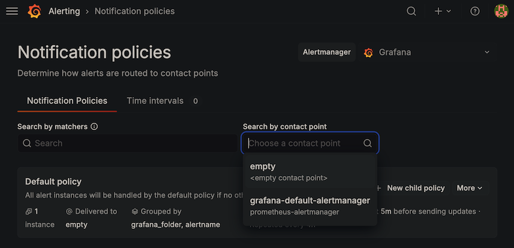
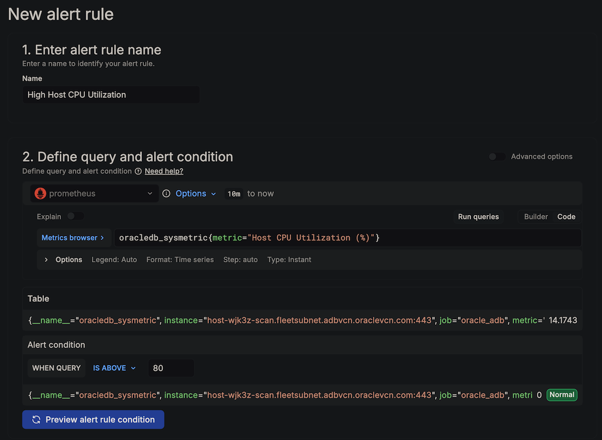
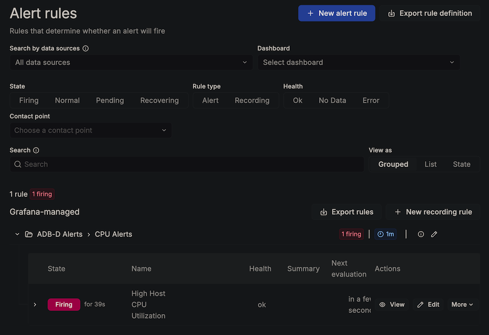

# Lab 6: Set Up a Grafana Alert

## Introduction

With your dashboard running, the final step is to configure alerting so you're notified when key metrics cross critical thresholds. In this lab, you will create a Host CPU Utilization alert using Grafana's built-in Alertmanager — you can later augment this with external notification channels or SMTP configuration.

*Estimated Lab Time:* 10 minutes

### Objectives

- Create a Grafana contact point using the built-in Alertmanager
- Configure a notification policy
- Create an alert rule for Host CPU Utilization
- Test the alert

### Prerequisites

- Completion of Lab 5 (Grafana dashboard with live data)

## Task 1: Create a Contact Point

Grafana requires at least one contact point before you can save an alert rule.

1. In Grafana, navigate to **Alerting** → **Contact points**.

2. Click **+ Add contact point**.

3. Configure:
   - **Name:** `grafana-default-alertmanager`
   - **Integration:** Select **Alertmanager**
   - Leave the URL as the default Grafana Alertmanager or manually enter `http://localhost:9093` if required

4. Click **Save contact point**.

    > **Note:** This uses Grafana's built-in Alertmanager, which surfaces alert state changes directly in the Grafana UI. For production, you can replace this with Email, Slack, PagerDuty, or any other supported integration.

    

## Task 2: Set the Default Notification Policy

1. Navigate to **Alerting** → **Notification policies**.

2. In **Search by contact point** select `grafana-default-alertmanager`.

3. If you navigate away and come back to the page you will notice a default policy has been set

    

## Task 3: Create the Alert Rule

1. Navigate to **Alerting** → **Alert rules** → **+ New alert rule**.

2. **Rule name:** Enter `High Host CPU Utilization`.

3. **Define query and alert condition:**

    - **Data source:** Select your Prometheus data source
    - **Code:** Switch from **Builder** to **Code** and enter:
      ```
      oracledb_sysmetric{metric="Host CPU Utilization (%)"}
      ```
    - Set **Alert Condition** to: **IS ABOVE** `80`
    - Click **Run queries** to confirm data appears

    

4. **Set evaluation behavior:**

    - Click **+ New folder** → name it `ADB-D Alerts`
    - Click **+ New evaluation group** → name it `CPU Alerts`, set evaluation interval to `1m`
    - **Pending period:** Set to `5m` (the alert only fires after CPU stays above 80% for 5 consecutive minutes — this avoids false alarms from brief spikes)

5. **Configure notifications:**

    - Set **Contact point** to `grafana-default-alertmanager`

6. **Add custom annotation:**

    - Scroll all the way down and click on the **+ Add custom annotation** button
    - **Custom annotation name:** `Host CPU utilization on ADB-D has exceeded 80%`
    - **Custom annotation content:** `Current value: {{ $values.A }}%. Investigate active sessions and wait classes.`

7. Click **Save**.

## Task 4: Verify the Alert

1. Navigate to **Alerting** → **Alert rules**. You should see your `High Host CPU Utilization` rule with status **Normal** (green), since CPU is likely below 80%.

2. To test it fires correctly, edit the rule and temporarily lower the threshold to a value below the current CPU utilization (e.g., change `80` to `5`).

3. Wait approximately 6 minutes (1 minute evaluation interval + 5 minute pending period). You should see the alert transition from **Normal** → **Pending** → **Firing** (red).

4. **Remember to set the threshold back to `80` after testing.**

    

## Task 5: Explore Additional Alert Ideas (Optional)

You can create more alert rules using the same pattern. Here are some useful PromQL expressions:

| Alert | PromQL | Suggested Threshold |
|---|---|---|
| High Avg Active Sessions | `oracledb_sysmetric{metric="Average Active Sessions"}` | Above your ECPU count |
| Low Buffer Cache Hit | `oracledb_sysmetric{metric="Buffer Cache Hit Ratio"}` | Below 90% |
| Tablespace Nearly Full | `max(oracledb_tablespace_used_pct)` | Above 85% |
| High Wait Time Ratio | `oracledb_sysmetric{metric="Database Wait Time Ratio"}` | Above 50% |

**Congratulations!** You have successfully built a complete Prometheus-compatible observability pipeline for Oracle Autonomous AI Database - Dedicated (ADB-D) — with live dashboards and proactive alerting — entirely from within the database using ORDS, PL/SQL, and standard Oracle performance views. No external agents or exporters required.

## Summary

In this workshop, you learned how to:

- Use ORDS `source_type_media` to serve custom content types from the database
- Build PL/SQL that outputs Prometheus exposition format from Oracle V$ views
- Secure REST endpoints with OAuth2 client credentials
- Deploy and configure Prometheus and Grafana on OCI Compute
- Build production-grade observability dashboards for ADB-D
- Configure Grafana alerts for proactive monitoring

## Next Steps

- **Add more metrics:** Extend the PL/SQL function to include SGA statistics, undo usage, ASM disk groups, or custom application metrics
- **Production alerting:** Configure Email, Slack, or PagerDuty contact points for real-time notifications
- **Production hardening:** Use OCI Vault for the OAuth2 client secret, set up Prometheus persistent storage, and configure Grafana LDAP authentication

## Acknowledgements

- **Author** - German Viscuso, Product Manager, Oracle Autonomous AI Database
- **Last Updated By/Date** - German Viscuso, April 2026
